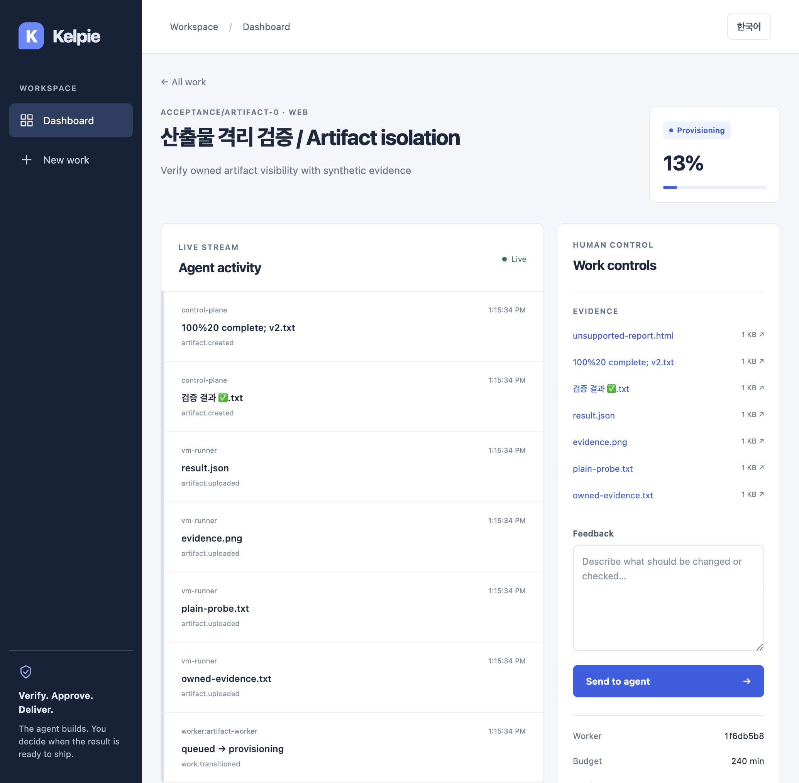
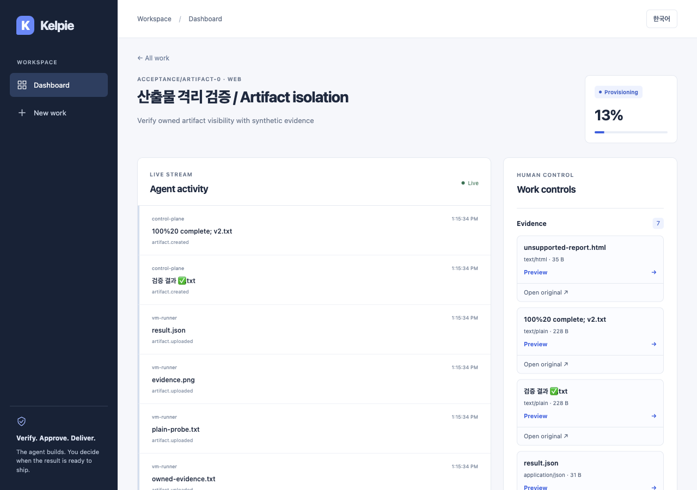
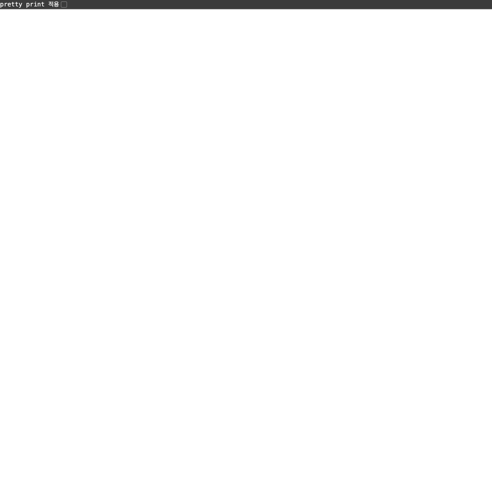
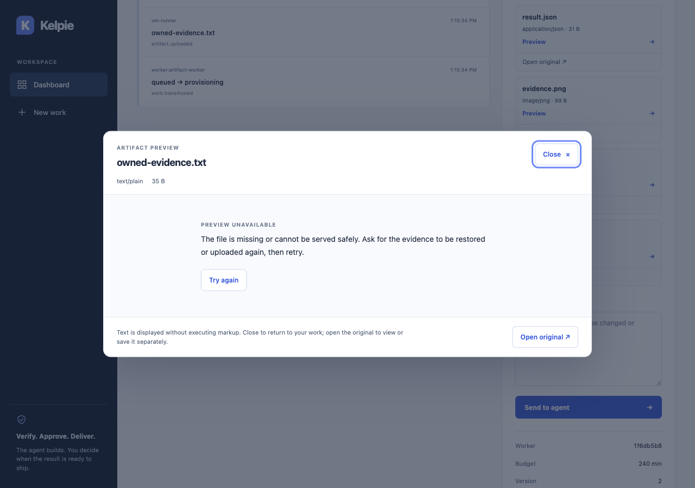

# Artifact preview in the work screen

[한국어](../ko/artifact-preview.md) | English

## Behavior and boundaries

Evidence cards show filenames, media types and sizes. View text, JSON and images without leaving the work screen; opening the original remains separate. Completed work permits reading without changing feedback or approval policy.

- Display only UTF-8 `text/plain`, `application/json`, PNG, JPEG and WebP. React escapes text; HTML/Markdown is not executed or embedded in an iframe.
- Enforce 10 MiB against actual streamed bytes as well as headers, and 15 seconds for the complete read. This does not replace API validation. Closing cancels requests and releases image Object URLs. Reopening/retrying makes a fresh request under existing authentication, authorization and `no-store` policy.
- Distinguish expired sessions, denied access, missing addresses, unavailable files, size/type/decoding failures, timeouts, connectivity and server failures in both languages. Never display raw error bodies or internal paths.
- A native `dialog` supports Close/Escape, Tab/Shift+Tab cycling and return to the opening button. When Retry disappears, focus remains in the file-content region. Support scrolling/keyboard navigation and wrapping long text/filenames. [MDN dialog](https://developer.mozilla.org/en-US/docs/Web/HTML/Reference/Elements/dialog), [Object URL release](https://developer.mozilla.org/en-US/docs/Web/API/URL/revokeObjectURL_static)

An explicit light surface and text colors retain contrast under a dark OS preference. This is not a site-wide dark theme. Previously downloaded/opened files cannot be retroactively erased after access revocation. New requests recheck server authorization; no persistent preview cache is added.

## Verification · 2026-09-06

Final executable code/regression commit: `c2efe0f`.

- Dedicated PostgreSQL 17 `make test`: API 738 tests (no skips, 89 seconds), Runner 6, Worker/Gateway and Web 83/TypeScript passed. After the Web changes, `make test-web`, `make lint` and the production build passed again. All 10 monitoring rules and the browser seed helper's Ruff check passed.
- Added 31 unit checks for headers/actual byte limits, timeout/cancellation/UTF-8 errors, supported types and bilingual empty states, names and sizes.
- All 26 Chromium tests took approximately 1.7 minutes; each of the 5 new preview cases took at most 1.4 seconds. The temporary API receives real scoped-worker uploads and lease release. Normal files, 410 and original downloads use real services; only UI failure branches such as slow responses, decoding failures, 401/403/404/500 and size limits use explicitly injected responses.
- Fixed Shift+Tab cycling and retry focus loss found in the actual browser. The latter failed `toBeFocused` before the fix and passed afterward. Tests also check late responses from closed files, image URL release, original UTF-8 filenames/bytes and inert script text.
- Closed-state tests permit exactly one read-only preview button and continue forbidding feedback input and other buttons. Existing regressions are not removed or weakened to permit mutations.

New tests run in the existing required `Web` CI. No dependencies, jobs, matrices, timeouts, environment variables or database migrations are added. Exact-head CI and merge results are recorded in the PR.

### Running services and visual evidence

Ran actual Uvicorn `:18550` and Next.js Standalone `:13550` in Orca. With scoped sessions and actual files, verified 410 → file restoration → Retry in the same preview returning 200/content/focus, foreign organization 404 → owner return 200, and 403 guidance after membership revocation. Inspected bilingual text, a 32×32 PNG, 1280px desktop and 390×844px narrow layouts, wrapping/no horizontal overflow and focus return on close. Computer Use also inspected the actual Orca window's narrow layout. This does not represent native OS-input verification.

Before cleanup, Console had zero messages; the 116 observed requests included intentional 410/404/403 and SSE 403 after revocation. The existing development-mode smooth-scroll warning remains a separate follow-up. This is not a claim of zero HTTP errors or actual IdP login verification.

Cleaned up the test sessions, tabs, servers and synthetic files/database; API shutdown-log checks passed. Removed the dedicated PostgreSQL test database only after verifying zero work rows/connections. Preserved existing databases and user processes.

These synthetic captures contain only the browser region. Before: `75662b9` (1035px); after: `c2efe0f` (1280px or 390px). Full-desktop captures showing other projects are not published.

| Before | After |
| --- | --- |
|  |  |
|  |  |

[Restored content](../assets/artifact-preview/restored-en.png) · [Korean narrow layout](../assets/artifact-preview/mobile-ko.png) · [Image](../assets/artifact-preview/image-ko.png)

## Operations and remaining scope

Use the existing production Web build/deployment procedure. The API contract is unchanged; proxies must preserve CORS, authentication and security headers. Roll back the Web feature commits to restore the original-link UI if needed. Do not roll back API file isolation, content validation or cache protection.

Ordinary artifact backup/restore and retention, real IdP, Linux/KVM, network and console-input isolation are not completed by this change. Evidence is synthetic and does not represent VM execution. The full P0/minimum-P1 MVP remains incomplete.
