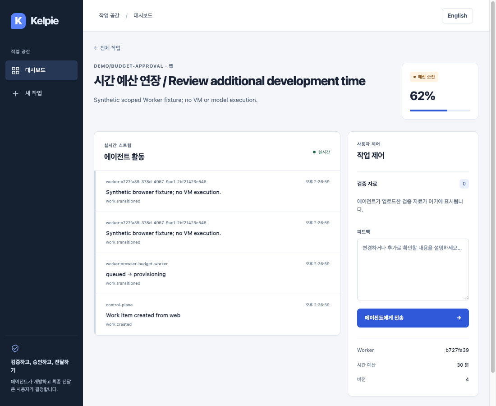
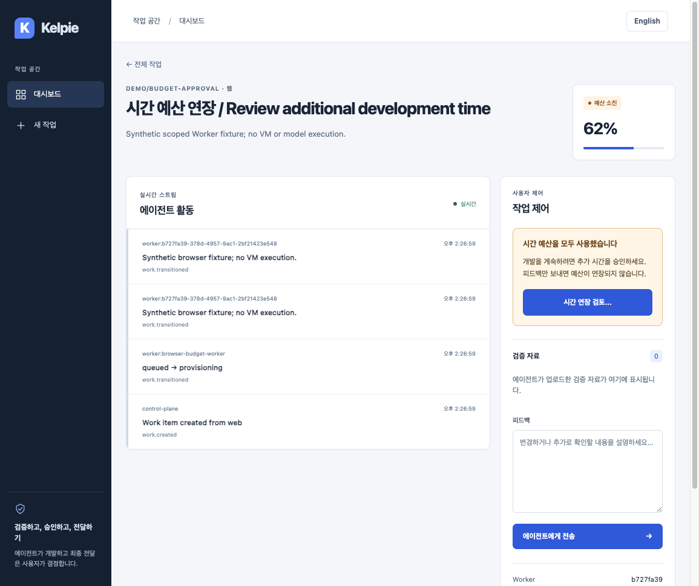
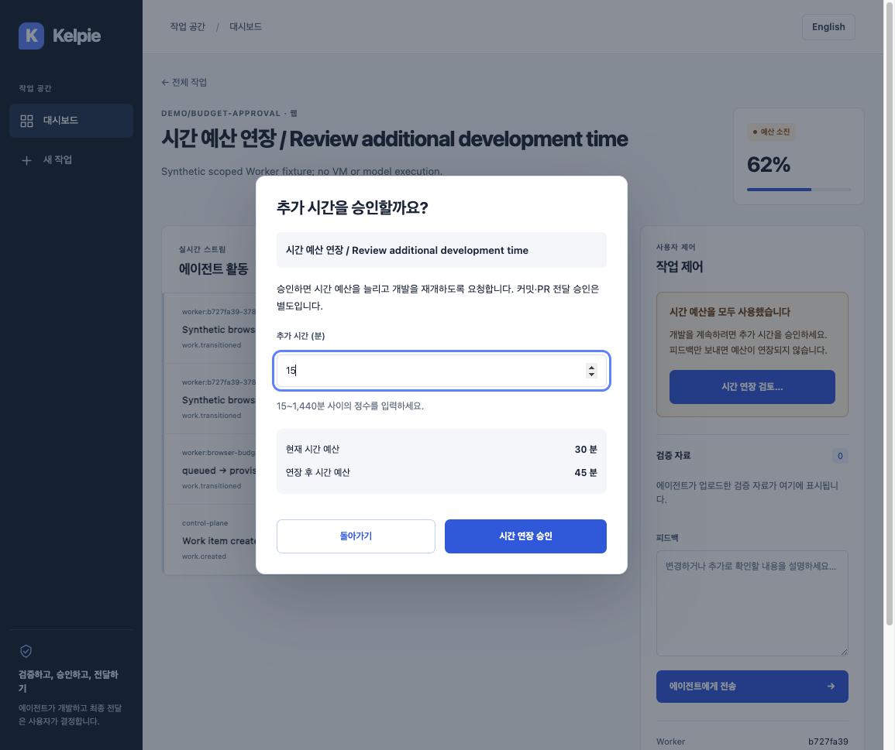
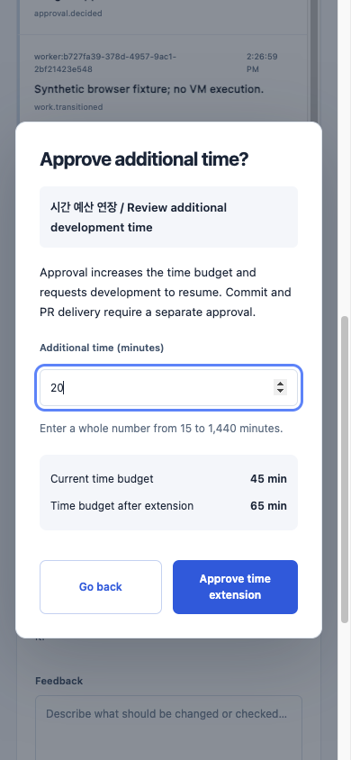

# Extending an exhausted time budget

[한국어](../ko/budget-approval-ui.md) | English

## User flow

Exhausted work shows a highlighted explanation and `Review time extension…` in its control panel. Feedback alone does not extend time. The confirmation shows the target work, additional minutes, current budget and resulting total. Korean and English are both supported.

Additional time must be an integer from 15 to 1,440 minutes; the initial input is 60. Empty, out-of-range and fractional values cannot be submitted. Go back and Esc close without approval. Initial focus is on Go back; after success, focus moves to the persistent status panel instead of the disappearing trigger. Inputs, buttons and Esc are locked while checking the approval response to prevent duplicate submission.

The existing [budget approval contract](budget-approval-version.md) is used. The work version captured when opening confirmation is sent as `expected_version`, together with `kind=budget`, `decision=approve` and `payload.minutes`. Success updates the budget/status and confirms a **request to resume development**, not actual Runner progress or completion. Commit and PR delivery still require separate approval.

Conflicts and live state/version changes invalidate the old confirmation. Close the dialog and review the latest budget again. After response loss, the latest work is fetched without replacing the reviewed version automatically. An unconfirmed result never produces a success notice. Permission denial has a separate message. Existing API Approver/admin authorization, organization boundaries and append-only audits remain enforced.

## Reproducible verification

- `make test-web`: 125 unit tests and type checking, including invalid minutes/versions/states and state-dependent controls in both languages.
- `make lint`: Ruff, Go vet and Web ESLint. Additionally check the test-only Python with `.venv/bin/python -m ruff check apps/web/e2e/budget-runtime.py`.
- `npm run test:e2e --prefix apps/web -- budget.spec.ts cancellation.spec.ts`: six new extension and six existing cancellation cases passed with actual Chromium, Next and API processes. The default E2E command and existing `Web` CI include them automatically.

New coverage includes approval, 390px confirmation and keyboard focus, input limits, duplicate submission while pending, explicit retry after transport failure, 409 after another approval/exhaustion cycle, lost success responses and live SSE changes. Budget, version and audit rows are queried from the actual API. The 403 UI case is an explicitly simulated response; actual OIDC enforcement remains covered by API regression tests.

Every run creates a fresh SQLite database with explicit development authentication. A separate scoped Worker credential calls actual claim/transition/release APIs; this is not VM or model execution. Worker tokens and leases are stored only in new mode-0600 files. Each owned lease is released before the unchanged shared release assertions run. `KELPIE_E2E_BUDGET_METADATA` is a temporary metadata path created and propagated by Playwright, not product configuration. No external account or production deployment is discovered.

No new CI job, matrix, dependency or timeout is added. The existing eight-minute `Web` job preserves confirmation screenshots in `browser-evidence`. There are no new product environment variables, database migrations or API changes. Rollback reverts the Web changes while retaining existing API version checks and audit/approval policy.

Full `make test` passed against a dedicated temporary PostgreSQL database: 1,197 API tests (225.57 seconds, no skips), 45 Runner tests, Worker/Gateway, and 125 Web tests plus type checking. Hands-on inspection found missing shared button styling; regression failed in both languages before applying the common design. Excess dialog spacing was reduced, with additional 320×568 checks for horizontal overflow, button accessibility and a minimum 44px height in both languages.

Physical VM time enforcement, active-run cancellation, concurrent Linux/KVM/WireGuard/noVNC isolation and complete MVP acceptance require separate verification.

## Hands-on production build · 2026-09-09

Verified implementation `c4127a9`, browser regression `5d4bb67` and hands-on design correction `aee5c46`. The final full E2E run passed 39 tests in 2.4 minutes; production build and static checks passed too.

Using an owned isolated API on `:18500` and production Web on `:13500`, the Orca browser opened confirmation and submitted actual input/approval. Korean input of 15.5 was rejected; approval of 15 changed 30 minutes/v4 to 45 minutes/v5. A scoped Worker exhausted the work again; SSE showed v7 in English. Reviewing and approving 20 minutes by keyboard produced 65 minutes/v8 and exactly two approval audit rows. The English mobile document width was 375px; dialog client/content widths were both 339px, without horizontal overflow. An initial CLI click on the offscreen trigger did not open the dialog; after verifying this, scrolling/focus/Enter confirmed actual opening.

Both observed approval POSTs returned 200, with no console errors or external requests. One navigation immediately after restarting production Web was refused; after checking readiness returned 200, navigation and operation succeeded. Computer-use captured the desktop but rejected native clicking because focus was unavailable even after restoration. Retries were stopped; this is not claimed as native input success or actual VM execution. System trust, authentication and Origin boundaries were not changed.

Reviewed synthetic-work captures follow. Desktop capture sizes are 1100×900 before and 1155×969 after; mobile is 390×844.

| Before | After |
| --- | --- |
|  |  |

| Korean confirmation | English mobile confirmation |
| --- | --- |
|  |  |
