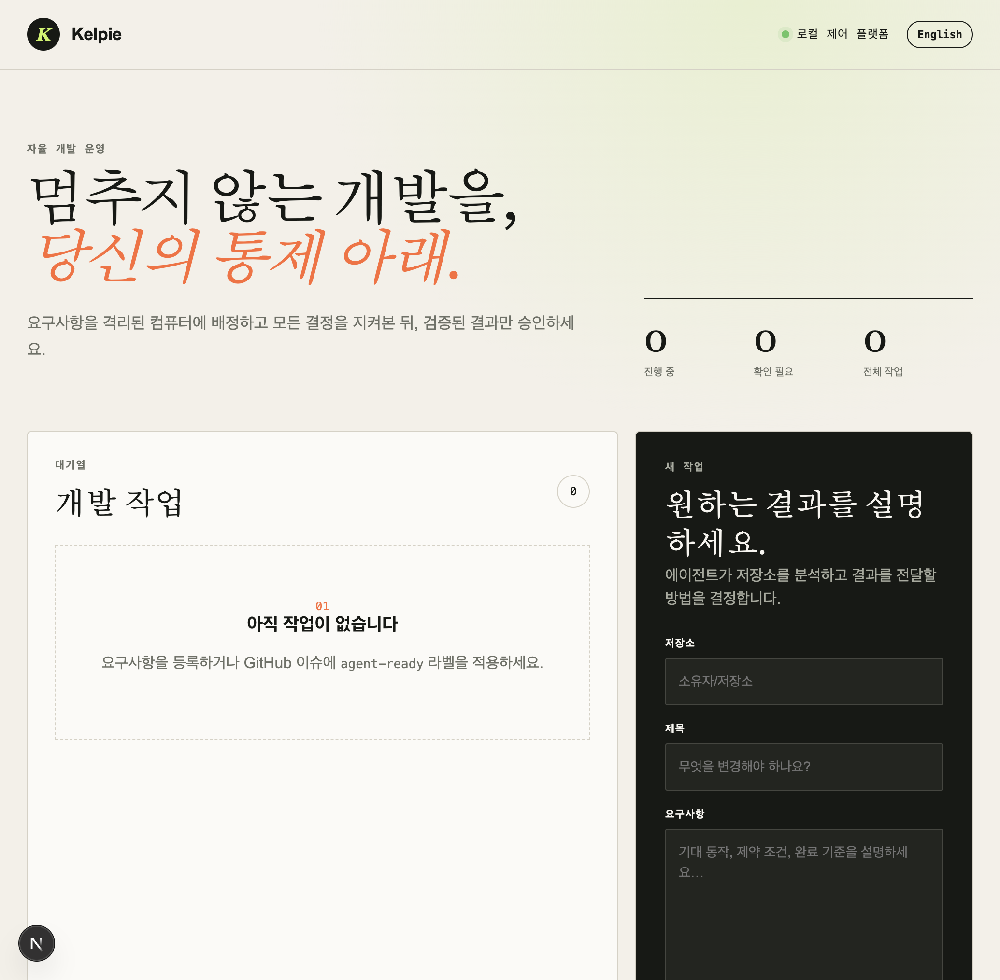
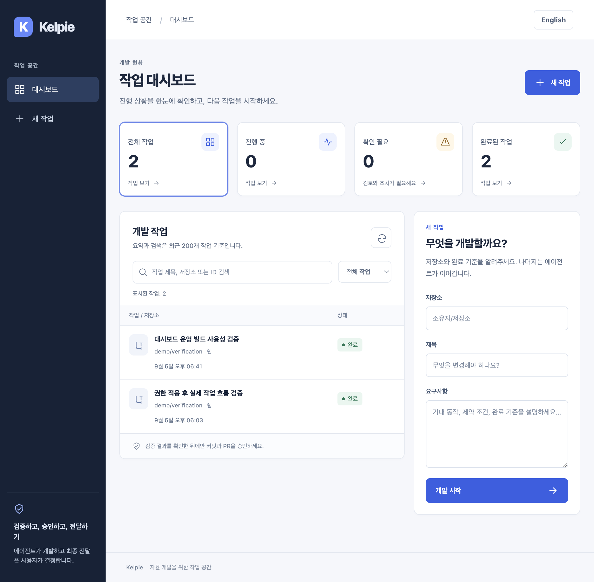

# Dashboard usability verification — 2026-09-05

English | [한국어](../ko/dashboard-verification.md)

## Outcome

Replaced the oversized promotional layout with a work-focused dashboard. Summary cards filter work status; title/repository/ID search, reset and creation share the same workspace. Summary and search explicitly cover the latest 200 items, not global statistics. Mobile cards and work rows stack vertically.

Added input-preserving retries, safe permission errors, actual SSE connection status, cursor-based reconnection, missing-work guidance and recovery from page-load failures. Korean and English catalogs stay synchronized. Product approval, authentication and authorization gates remain intact.

## Evidence

- `make test`: API 89, Runner 6, Web 12 plus type checking, Worker/Gateway Go tests passed
- `make lint`, `npm run build --prefix apps/web`: passed
- `npm run test:e2e --prefix apps/web`: eight Chromium tests passed in 29.4 seconds locally
- Reproduced before fixing: offline work creation, falsely live disconnected SSE and server errors for missing work
- Real PostgreSQL 17 + API + production Web build + Mock Worker: creation → feedback → re-verification → approval → completion → resource release
- Orca browser: performed that journey and verified no console errors during the normal flow
- Chrome desktop Computer-use: directly entered search text, checked no results and reset filters
- Visually inspected actual Chromium rendering at 390px and in English; E2E horizontal-overflow check passed
- Stopped the dedicated test API to confirm the error UI, restarted it and recovered the list using the retry button
- Display UTC storage timestamps in browser-local time while correcting missing SQLite offsets and the initial SSR timezone. The Honolulu browser regression reproduced a ten-hour error before the fix and passed afterward.

The executor is Mock. This does not prove actual GitHub delivery, external IdP login, VM/WireGuard/noVNC operation or concurrent KVM isolation. Consult this UI PR's GitHub record for its own CI and merge results.

## Before and after

The before/after screenshots use different test data. Both show test environments without actual credentials.

[English](../assets/dashboard-ux/english.jpg) · [Mobile](../assets/dashboard-ux/mobile.jpg) · [Completed work detail](../assets/dashboard-ux/detail.jpg)

## Logical commits

| Commit | Purpose |
| --- | --- |
| `10c26b2` | Work-focused layout, search and filters |
| `21ed44a` | Isolated real-service browser test harness |
| `04bbb96` | Input-preserving recovery from network failures |
| `6a84dbb` | SSE status and reconnection |
| `92dd0a3` | Version-matched Next.js agent instructions |
| `8dab2e5` | Exclude generated browser reports from linting |
| `c1996fd` | Missing/loading/error page recovery |
| `f21250f` | CI browser checks and evidence retention |
| `cfb7e23` | Hands-on evidence and reproduction documentation |
| `9d8d7cb` | Browser timezone and UTC timestamp normalization |

The subsequent documentation commit provides this verification record and reproducible instructions.
