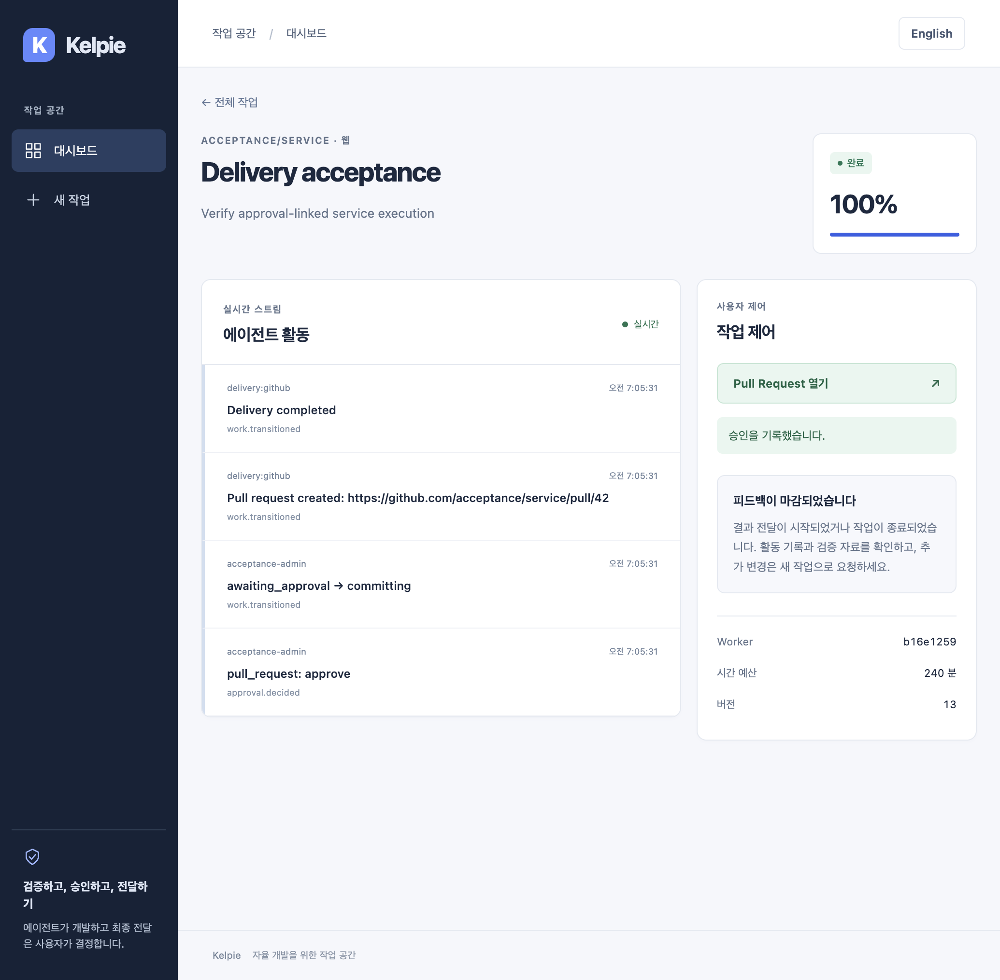
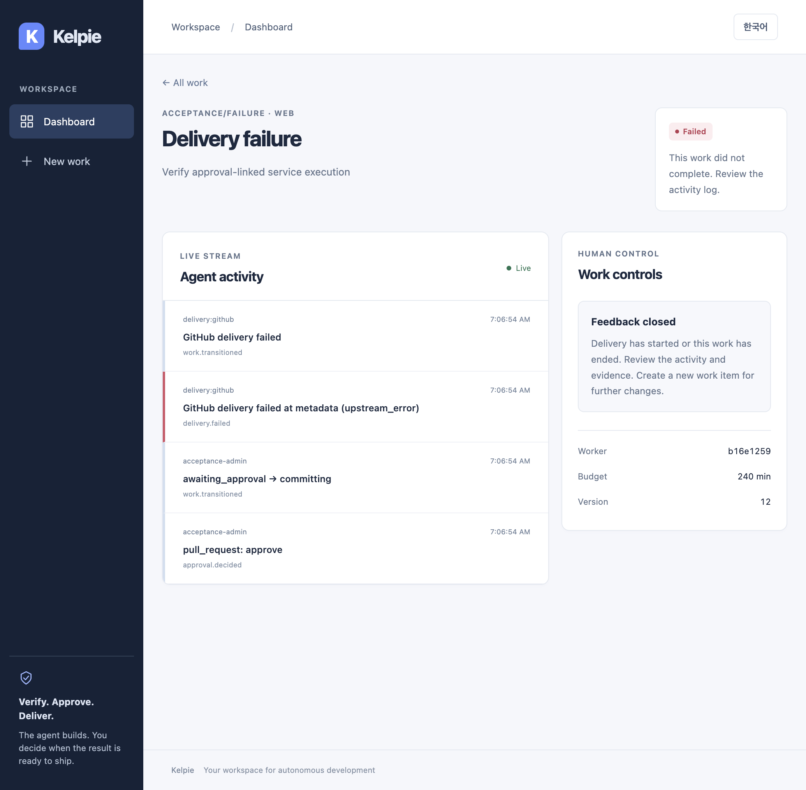

# Approval-linked delivery audit

[한국어](../ko/delivery-audit.md) | English

## Evidence and boundaries

This IAM-001 batch audits central GitHub delivery. Scheduling an approved web/Slack PR links `DeliveryJob.approval_audit_id` to its append-only `approval.decided` record. Approval, state, events, audit and scheduling share one transaction; a persistence failure prevents the background task from starting.

The executor is the `delivery:github` service, not a human session. Service records use `transport=background`, `identity_provider=urn:kelpie:service` and null principal ID, roles and source IP. The referenced approval retains the human identity, provider, role decision, request ID and ASGI peer IP. Human privileges are not copied onto the service, and the service does not claim to use that person's session. Required-role constraints on web/Slack records remain intact.

At attempt start, inside the write guards before token issuance, push and PR creation, and during finalization, delivery checks approval organization, repository, work, correlation ID, approved PR decision, Approver-or-higher role, scheduling flag, approved work version and bundle metadata hash. Missing or mismatched authority blocks external writes. This remains delegation from the recorded approval, not a new policy retroactively applying later membership changes. Worker quarantine still fences subsequent writes.

The hash identifies **approved bundle metadata**. Follow-up [byte verification](delivery-integrity.md) rehashes files on approval/download and before token issuance, then applies a fixed copy in Git. Remote Git trees are still not attested. External PR creation and the database commit are not a distributed transaction; failure does not prove absence of external side effects.

| `action` | Meaning |
| --- | --- |
| `delivery.started` | A verified new attempt; persisted before external calls |
| `delivery.completed` | Stored with the delivery result and completed work/job |
| `delivery.failed` | Authority rejection or delivery error; stored with failed state/events |
| `delivery.stopped` | Observed state when an active attempt is fenced; does not overwrite quarantine/resources |
| `delivery.interrupted` | Startup recovery found a running job; external outcome remains uncertain |

Each attempt has a fresh UUID request ID shared by its start/outcome. Recovery interruption has a separate request ID and the previous attempt number. Details retain the verified approval ID, approved hash/version, attempt, worker ID, current work/job state and version, bounded stage/error/publication path, and validated PR number. Unverified authority has null reference/hash and `authorization=denied` or `unavailable`. Publication values `new_branch`, `existing_branch` and `existing_pull_request` describe paths, not successful-write proof; recovery may report `unknown`. Tokens, patch paths, arbitrary URLs and raw upstream errors are excluded. Raw database errors are also excluded from traces.

## API compatibility

The existing `POST /api/work-items/{id}/approvals` request `{"kind":"pull_request","decision":"approve"}` and WorkItem response shape remain unchanged. A `committing` response means approval acceptance, not final delivery. Existing retrieval/SSE reports the final state.

Administrator-only `GET /api/work-items/{id}/audit-log` retains organization/repository isolation, cursor/limit and `Cache-Control: no-store`. Selected fields from a synthetic new background response:

```json
{
  "action": "delivery.completed", "actor_id": null,
  "actor_subject": "delivery:github", "identity_provider": "urn:kelpie:service",
  "transport": "background", "source_ip": null,
  "organization_role": null, "repository_role": null,
  "effective_role": null, "required_role": null,
  "details": {
    "approval_audit_id": 1, "authorization": "verified",
    "approved_work_version": 11, "attempt": 1,
    "work_status": "completed", "work_version": 13, "job_state": "completed",
    "stage": "finalize", "error_code": null,
    "publication": "new_branch", "pull_request_number": 42
  }
}
```

External audit clients must support the new transport and nullable roles before rollout. Human record roles are unchanged. Repository-wide consumers are the API schema and tests; Web, Worker, Gateway and Runner have no separate copy of this response contract. No endpoint, environment variable, dependency or audit UI is added.

## Migration and recovery

Pause new approvals, drain existing delivery, stop API writers and back up. Before restarting the API, run `make migrate-api` and `.venv/bin/python -m alembic -c apps/api/alembic.ini check` to apply `20260906_0009`. Revision `0008` belongs to unmerged Preview PR #21, so the current main chain is `0007 → 0009`. That PR must update its parent revision against the new main and be revalidated when integrated.

PostgreSQL exclusively locks both tables. SQLite takes a write lock before batch recreation and reinstalls append-only triggers. Existing audit/job rows survive; legacy job references stay null. No historical approval is guessed or backfilled. Remaining legacy pending/running jobs fail with `approval_unavailable` on recovery; request a new verified work item and explicit approval instead of manually manufacturing links. [Alembic batch behavior](https://alembic.sqlalchemy.org/en/latest/batch.html)

Online downgrade is allowed under locks only with an empty audit table and no approval references. Retained records/references or offline mode reject downgrade without changing data/revision. Do not delete evidence, disable guards or manually stamp to bypass it. Old binaries fail readiness against the new schema; deployments retaining evidence require a forward fix with the schema intact.

A start-audit failure rolls back to pending/previous attempts without issuing a token. A completion-audit failure rolls back completion, retaining `running`. After database recovery, existing API startup recovery records interruption and begins a new attempt that queries existing PRs/branches. This is not a continuously scanning queue worker or automatic retry UI for ordinary failed jobs. Deleted jobs/work cannot receive a new stopped record. Actual VM cleanup and lease return are outside this audit change.

## Verification · 2026-09-06

Runtime code: `3c3797e`; reproducible fixtures/tests: `e5942a4`. Subsequent documentation/images do not change executable code.

- `make test` with a dedicated PostgreSQL URL: API 502, Runner 6, Worker/Gateway, Web 52 and TypeScript passed. `make lint` and production Web build passed. PostgreSQL 17 upgrade/check/empty downgrade/re-upgrade, retained-row migration, nonempty downgrade refusal, service/human constraints and append-only guards were checked.
- Two new database-trace regressions failed before the fix and passed afterward. The 47 delivery/disclosure tests cover forged/missing authority, version changes, audit insert rollback, quarantine, concurrent duplicates, and recovery without a second PR after completion-audit failure.
- Web/signed-Slack integration tests connect a retained OIDC principal's approval to the actual delivery code. Audit reads return 403 for Approver, 404 for another organization's administrator, and 200 for the owning administrator. These are fixtures, not live IdP/Slack services.
- `test_delivery_http_runtime.py` runs fresh SQLite migrations, real Uvicorn HTTP and Git clone/apply/commit/push with a loopback SCM server. It checks the remote branch file and commit count, one PR creation, success/failure audit, duplicate approval 409 and unchanged evidence. External GitHub calls are blocked; this is not live GitHub App installation or KVM acceptance.
- The same fixture ran API `:18460` and production Web `:13460`. Orca browser button clicks exercised Korean approval → completed/100%/PR link and English 390px approval → failed/bounded error/closed feedback. Both flows produced three audit records with distinct human/service request IDs, correct authority/hash/version, no-store, duplicate approval 409 without new audit, and one local PR write. KO/EN state/language transitions at 1035px/390px had no horizontal overflow or console errors; network requests succeeded apart from the intentional duplicate 409.
- Computer-use inspected the actual narrow layout in the Orca desktop window. OS focus was unavailable and browser Tab input did not demonstrate focus movement, so manual keyboard acceptance is not claimed. This API audit change does not modify UI/native input. Repeated-render mobile captures were excluded from evidence; only the reviewed desktop captures below are attached.




The existing required `Python` CI job automatically runs the new tests/migration through its full suite and PostgreSQL audit checks. No extra job, matrix or duplicate build is added; language parallelism, caches and eight-minute limits remain. Exact final-head CI/browser E2E results and merge SHA are recorded in the PR.

Remaining MVP work includes active administrator cancellation/VM cleanup, retries/retention/backup/recovery, OIDC preview grants, external dependency/worker/lease operations checks, comprehensive secret-disclosure checks and real KVM/WireGuard/noVNC input isolation. No approved Linux/KVM host is available yet; PR #21's direct TLS browser acceptance is separately incomplete. The full MVP is not marked complete.
