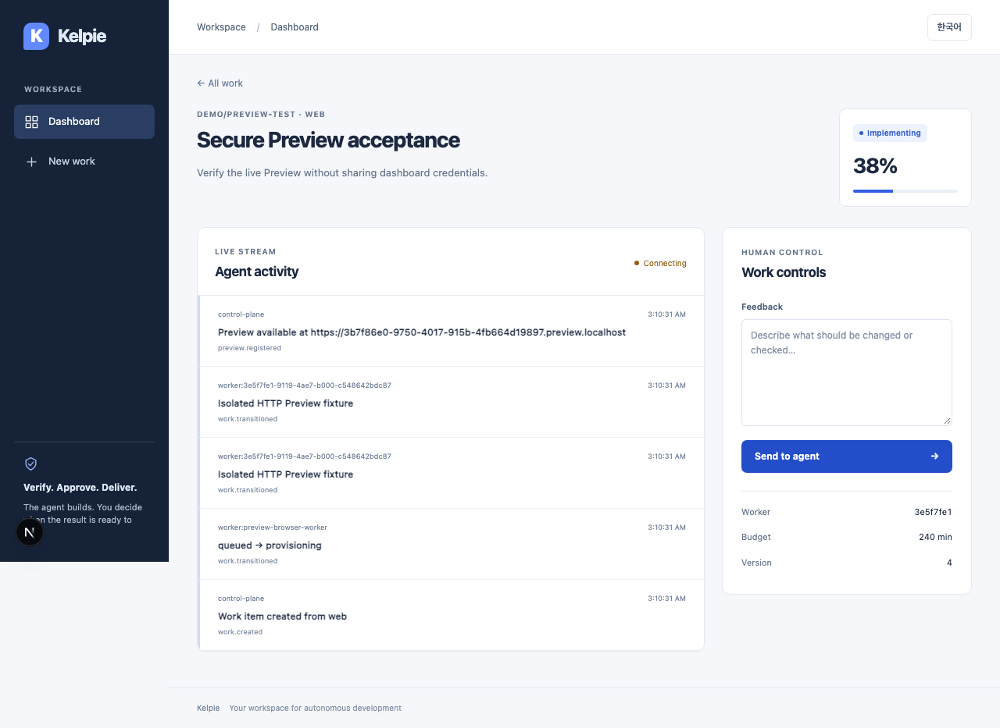
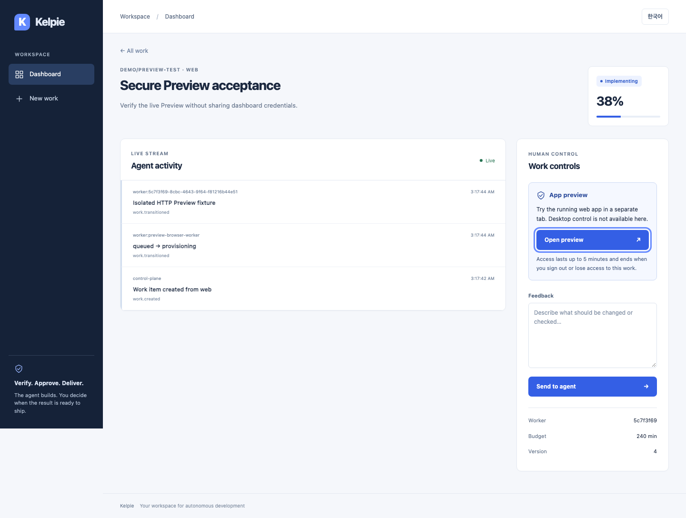

# OIDC HTTP Preview access

[한국어](../ko/preview-access.md) | English

## Behavior and security boundaries

**App preview** on the work detail page obtains a one-time grant bound to the current OIDC session and opens the running web app in a new tab. Current organization/repository Viewer access or higher is required. Korean and English cover loading, unavailable previews, connection/permission failures, blocked pop-ups and retries. Unconfigured environments do not show the launch button.

- A launch code can be exchanged once within at most 30 seconds. It travels in an HTTPS form POST body, never a URL or browser storage.
- Access is scoped to the work hostname and login session for at most 5 minutes, bounded by the earlier parent-session/preview expiry. The `__Host-kelpie_preview` cookie is Secure, HttpOnly, SameSite=Strict, Path=/, without Domain. The new tab's opener is removed.
- The database stores only SHA-256 hashes of random codes/tokens. `preview.granted` audit snapshots record the actor, current role decision, work and hostname, without credentials.
- Every request rechecks the current session, issuer, membership, repository ownership, Worker quarantine, endpoint expiry and allowed CIDR. PostgreSQL tests cover Worker locking and conditional updates during quarantine and concurrent exchanges.
- Existing HTTP streams/WebSockets revalidate every 2 seconds. Including a 2-second authorization timeout, revocation, target changes or control-API failure close the connection within approximately 4 seconds under normal scheduling; the grant deadline also closes it. Already downloaded content cannot be recalled.
- The gateway strips platform authentication/cookies/control headers from upstream requests. It blocks reserved cookie names, removes application-cookie Domain and sets Secure. Cross-origin HTTP redirects/requests and service/web workers are blocked.

This feature provides **HTTP Preview and the app's WebSockets** only. It does not make the web application's own mutations read-only. OIDC gateway `/console` access is denied. Real KVM/WireGuard isolation and noVNC input ownership remain separate MVP requirements.

## Configuration and rollout

Defaults remain API `PREVIEW_ACCESS_ENABLED=false` and gateway `KELPIE_GATEWAY_AUTH_MODE=disabled`. The existing development Compose profile remains development-only; it is not automatically converted to a production OIDC deployment.

1. Back up the database, then run `alembic -c apps/api/alembic.ini upgrade head` and `check`. Revision `20260906_0008` adds `preview_grants`, its session FK and expiry/single-exchange indexes.
2. Configure [OIDC/IAM](operations.md#oidc-authentication). Keep the dashboard/API on one public HTTPS origin, with a **fresh dedicated preview domain on another site**, e.g. `control.example.com` and `preview.example.net`. Do not reuse a development-preview domain with previously installed service workers.
3. Configure wildcard DNS/certificates and a private target network reachable only through the gateway. Limit `PREVIEW_ALLOWED_CIDRS` to required VM subnets. Do not copy the fixture's loopback CIDR into production.
4. Apply the settings below. Inject certificates and gateway tokens through secret management/protected mounts. Never place actual values in documentation, source control or screenshots.

| Setting | Default | Purpose |
| --- | --- | --- |
| `PREVIEW_ACCESS_ENABLED` | `false` | Enable OIDC grant issuance/resolution |
| `PREVIEW_DOMAIN` | `preview.localhost` | Dedicated work-hostname suffix |
| `PREVIEW_HTTPS_PORT` | `443` | External browser-facing TLS port, 1–65535 |
| `PREVIEW_ALLOWED_CIDRS` | `10.0.0.0/8` | Allowed literal-IP HTTP targets; narrow in production |
| `KELPIE_GATEWAY_AUTH_MODE` | `disabled` | Set `oidc` for authenticated gateway access |
| `KELPIE_GATEWAY_TLS_CERT_FILE` / `KELPIE_GATEWAY_TLS_KEY_FILE` | Empty | Both mandatory in `oidc` mode |
| `KELPIE_GATEWAY_LISTEN` | `:8080` | Gateway TLS listener; deployment maps the external port |
| `GATEWAY_SECRET` or `GATEWAY_SECRET_FILE` / `KELPIE_GATEWAY_TOKEN` | Empty | Matching API/gateway-only secret of at least 32 characters |

Terminate TLS directly at the gateway or use TCP pass-through. HTTP TLS offload and `X-Forwarded-Proto` are not trusted. Restrict `KELPIE_CONTROL_URL` to a trusted internal API path and isolate that network. API redirects never receive forwarded credentials.

Domain validation conservatively rejects matching final two DNS labels with the dashboard/API. This is not a public-suffix implementation: a shared suffix such as `co.uk` can reject distinct registered domains. Use a separate domain satisfying the policy instead of bypassing it. A modern browser providing Origin or Fetch Metadata is required. Worker, reserved-cookie and external-redirect restrictions mean not every web app is compatible.

## API contract

Using the current OIDC cookie, `GET /api/work-items/{id}/preview-access` returns `{ "available": true, "expires_at": "<UTC expiry>" }` or `{ "available": false, "reason": "not_configured" | "unavailable" }`. Private target addresses are not exposed.

`POST /api/work-items/{id}/preview-grants` from the dashboard origin returns HTTP 201 with the following shape. These are placeholders, not credentials:

```json
{
  "launch_code": "<one-time code>",
  "exchange_url": "https://<work-id>.preview.example.net/_kelpie/authorize",
  "expires_at": "<launch expiry>"
}
```

POST a single `code` field as `application/x-www-form-urlencoded` to gateway `/_kelpie/authorize`. The real dashboard Origin is required; query parameters are rejected. The gateway calls internal `/internal/previews/exchange` and `/internal/previews/authorize` using service authentication. Never give the browser service secrets or expose these internal routes directly. Missing/expired access can return 401, access/origin mismatch 403/404, missing/quarantined endpoints 410, and disabled/console access 503. These contracts are additive; development-preview compatibility is retained.

## Verification and limitations

- `make test`: API 409 including PostgreSQL, Runner 6, Worker/Gateway, Web 49 and type checks passed. `make lint`, gateway `go test -race ./...` and the production Web build passed.
- API Preview 56 and PostgreSQL Preview 24 tests cover Viewer access, session/membership/endpoint/CIDR revocation, TTL bounds, replay/concurrent exchanges and real PostgreSQL locking in both directions.
- `npm run test:e2e:preview --prefix apps/web` starts real OIDC discovery/JWKS/RS256/PKCE, TLS API/gateway/Next.js and an HTTP/WebSocket fixture. Four development-server journeys passed in about 22 seconds; a separate run on the `99bae1f` production build passed in about 15 seconds.
- Korean/English, 1440px/390px, keyboard focus, overflow, loading/pop-up/access failures and recovery, opener removal, no URL/storage/cookie disclosure, a real WebSocket and logout-triggered disconnect/401 were checked. Normal UI journeys had no unhandled browser errors.

The fixture generates disposable certificates/secrets in a temporary directory and removes them. It does not alter OS trust stores. Free `13443/13530`, `18443/18530`, `19443/19330`, `14443` and `16330`, and stop another Next server in the same checkout before running. CI adds this test to the existing Web job and does not retain traces that could contain OIDC credentials. Only for your own isolated local fixture, `KELPIE_PREVIEW_REUSE=1` permits reuse; CI ignores it.

This synthetic HTTP fixture does not prove enterprise-IdP integration, public DNS/certificates, VM/KVM, WireGuard, noVNC or completion of two genuinely isolated work items. Those environment checks remain MVP release requirements.

Direct interaction verification is still pending. Chrome windows disappeared from `computer-use`, and Orca input was blocked with `window_not_focused` (no focused window). One restore retry did not resolve it, so further input stopped. The embedded browser's self-signed certificate warning was observed, but its exception was not accepted. Product screenshots below were captured in independent Chromium runs and visually reviewed; they do not represent completed separate Browser/Computer-use interaction. Keep the PR Draft and unmerged until the final journey is performed after unlocking the Mac and activating Orca.

## Screenshots

Before: Web preceding `5321043` at 1280px. After: `99bae1f` production build at 1440px. The same synthetic work title is used across different isolated runs. The 390px captures also show keyboard focus.





[Korean](../assets/preview-access/after-ko.png) · [390px Korean](../assets/preview-access/mobile-ko.png) · [390px English](../assets/preview-access/mobile-en.png)

## Rollback

Disable the API flag and gateway, terminate existing gateway connections and deploy the previous application. If a database downgrade is needed, target `20260906_0007`. This removes only disposable preview grants, revoking their access while retaining auth sessions, work and append-only audit records. Do not drop audit tables during an ordinary rollback.
