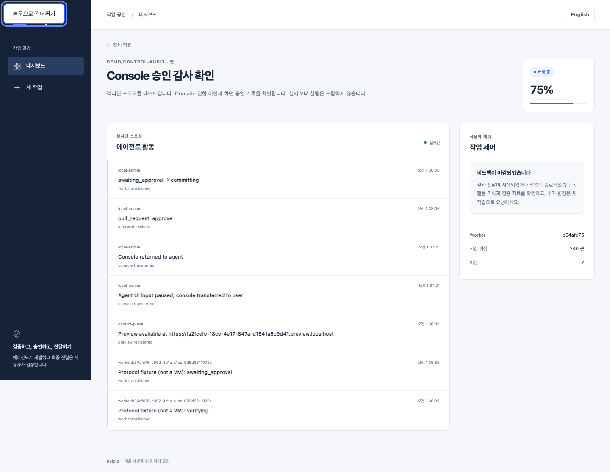
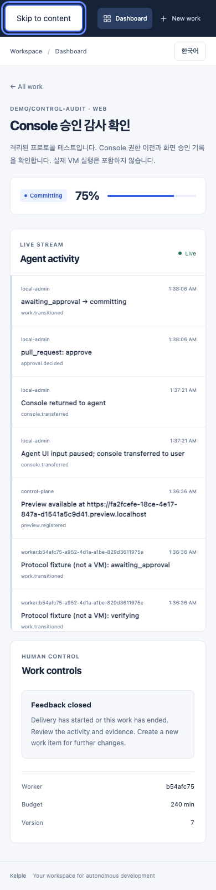
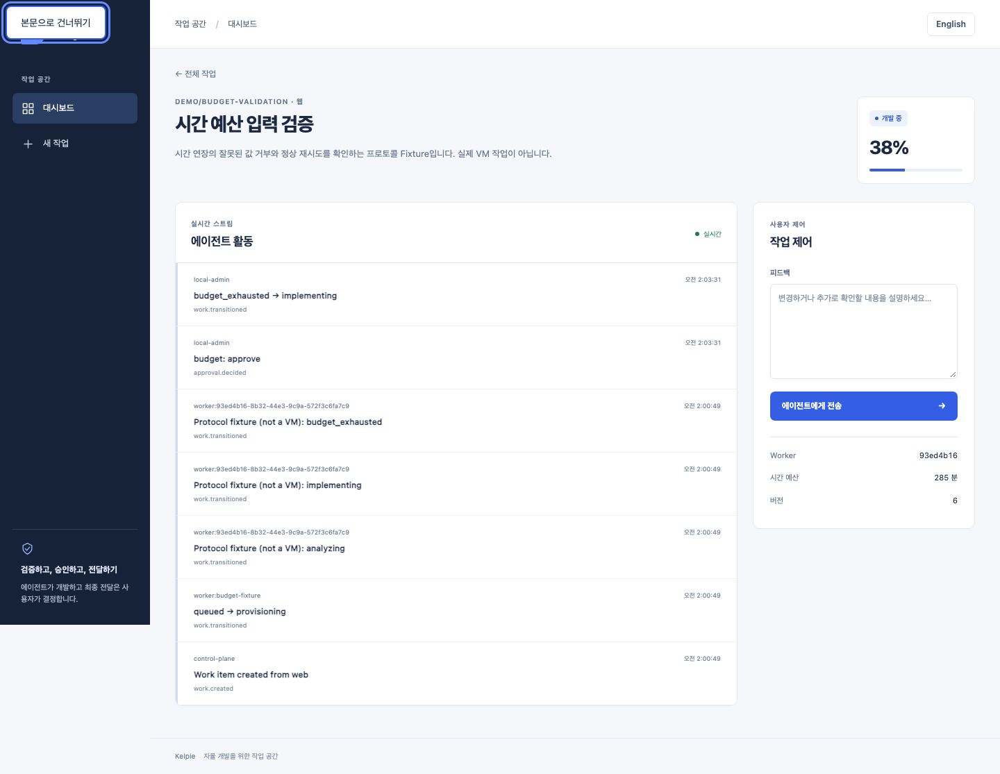
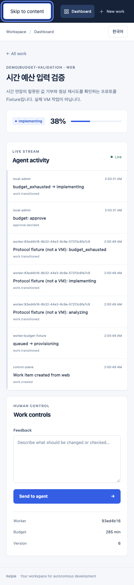

# Console·승인 감사 기록

한국어 | [English](../en/control-action-audit.md)

## 계약과 보안 경계

IAM-001의 두 번째 감사 Batch입니다. [피드백 감사](feedback-audit.md)의 추가 전용 Guard, Administrator 전용 조회, 조직·저장소 격리, 당시 신원·Role·Request ID·Correlation ID·ASGI IP 정책을 그대로 사용합니다. 기존 요청·응답과 승인 게이트는 유지하며 감사 조회 응답에 `details` 객체만 추가합니다. 이전 행과 피드백 행의 `details`는 `{}`이고 과거 행을 소급 작성하지 않습니다.

| 행위 | `action` / `target_id` | `details` |
| --- | --- | --- |
| Console 획득·재획득·반환 | `console.transferred` / 작업 ID | `action`, `holder_type_before/after`, `holder_before/after`, `version_before/after`, 작업 후 UTC `expires_at` |
| 웹 PR·시간 예산·Console 승인/거절, Slack PR 승인 | `approval.decided` / 승인 행 ID | `kind`, `decision`, `budget_minutes_before/after`, `work_status_before/after`, `work_version_before/after`, `delivery_queued`, `delivery_bundle_sha256` |

중앙 전달을 예약한 PR 승인에는 해당 Bundle의 SHA-256을 기록합니다. Mock 실행·거절·다른 종류의 승인은 `delivery_queued=false`, Hash는 `null`입니다. 이 Hash는 승인 대상을 식별하며 실제 전달 완료나 외부 저장소의 내용을 증명하지 않습니다. 기존 `console` 종류의 승인은 결정만 기록하며 Console 소유권을 바꾸지 않습니다. 소유권 변경은 별도의 Console Lease Endpoint입니다.

성공한 변경, 활동 이벤트, 승인 행, 전달 예약과 감사는 같은 트랜잭션입니다. 감사 INSERT 실패 시 소유권·만료·버전, 시간 예산·상태·이벤트·전달 예약을 함께 Rollback하고 전달 Background Task도 시작하지 않습니다. 권한 부족, 다른 조직, 오래된 버전/상태, 다른 Console 소유자, 미검증 Bundle에는 성공 감사를 남기지 않습니다. 거부 시도 자체의 감사는 후속 범위입니다. 임의 승인 Payload·사유·토큰은 감사에 복사하지 않으며 기존 승인/활동 로그의 보존 동작은 변경하지 않습니다.

합성 요청: `POST /api/work-items/{id}/approvals`에 `{"kind":"budget","decision":"approve","payload":{"minutes":45}}`를 보내면 예산 소진 상태와 Approver 권한을 검사합니다. 성공 응답은 기존 WorkItem JSON이고 감사 조회의 주요 필드는 다음과 같습니다.

```json
{
  "action": "approval.decided", "target_id": "7", "transport": "web",
  "required_role": "approver",
  "details": {
    "kind": "budget", "decision": "approve",
    "budget_minutes_before": 240, "budget_minutes_after": 285,
    "work_status_before": "budget_exhausted", "work_status_after": "implementing",
    "work_version_before": 6, "work_version_after": 7,
    "delivery_queued": false, "delivery_bundle_sha256": null
  }
}
```

## 시간 예산 입력 계약

`kind=budget`, `decision=approve`의 `payload.minutes`는 15~1440 범위의 **JSON 정수**여야 합니다. 생략하면 기존처럼 60분을 연장합니다. 범위는 한 번의 연장량이며 누적 예산의 상한을 새로 설정하지 않습니다. `null`, Boolean, 문자열, 배열, 객체, 소수 표기(`60.0` 포함), 범위 밖의 정수는 422와 `{"detail":"invalid budget extension"}`으로 거부됩니다. 예산·작업 상태·버전·승인·이벤트·감사는 변경하지 않으므로 올바른 정수로 재시도할 수 있습니다.

이전에는 `"60"`을 숫자로 변환하고 `15.9`를 15로 잘랐지만 이제 둘 다 거부합니다. 이런 입력을 보내던 Client는 사용자 의도를 확인한 뒤 JSON 정수(예: `{"minutes":60}`)를 전송해야 하며 임의로 버림 처리하지 않아야 합니다. 조직·저장소 권한, 예산 소진 상태, 격리 검사는 그대로 유지됩니다. 예산 **거절**은 연장량을 적용하지 않아 `minutes` 검사를 요구하지 않습니다. PR·Console 승인 Payload는 이번 수정의 대상이 아닙니다. DB·환경변수·의존성 변경은 없습니다.

## Migration과 복구

백업 후 API Rollout 전에 `make migrate-api`와 Alembic `check`로 `20260906_0007`을 적용합니다. 기존 감사 행을 수정하지 않고 JSON 컬럼을 기본값 `{}`로 추가합니다. 새 환경변수·의존성은 없습니다. 빈 감사 테이블만 잠금 아래 Online Downgrade할 수 있습니다. SQLite Batch 재생성이 제거하는 기존 Trigger도 다시 설치합니다. [Alembic Batch 동작](https://alembic.sqlalchemy.org/en/latest/batch.html)

감사 행이 하나라도 있거나 Offline 모드이면 Downgrade를 거부하여 데이터와 Revision을 보존합니다. 기록 삭제·Guard 해제·수동 Stamp로 우회하지 않습니다. 이전 API의 Schema Readiness 검사 때문에 단순 Binary Rollback도 불가능하므로 최신 Schema를 유지한 전진 수정으로 복구합니다. 외부 WORM·DB 관리자 DDL 차단·자동 보존/반출 기능은 추가하지 않습니다.

## 검증 · 2026-09-06

기반 `740d902`, Console `4210b36`, 승인·E2E `77b9a31` 기준입니다. 후속 문서·이미지는 실행 코드를 바꾸지 않습니다.

- `make test`: API 288개, Runner 6개, Worker·Gateway, Web 40개와 TypeScript 통과. 기본 실행에서 생략된 PostgreSQL 17개는 별도 테스트 DB의 `test_worker_postgres.py test_audit_postgres.py`로 모두 통과했습니다. `make lint`, Web Build, Chromium E2E 12개(약 1.1분) 통과. 기존 CI의 Python/PostgreSQL과 Web Job이 자동으로 새 테스트·Migration을 실행하므로 추가 Job·Matrix는 만들지 않았습니다.
- SQLite 이전 행 보존·비어 있지 않은 Downgrade 거부·빈 Downgrade 후 Guard 유지, PostgreSQL 17 Upgrade/Check/Downgrade/Re-upgrade/Check를 확인했습니다. 감사 장애 회귀 테스트는 승인·소유권과 전달 예약의 원자성을 검증합니다. OIDC 연결 Principal과 서명된 Slack 요청은 통합 테스트 Fixture이며 실제 외부 Provider·Slack 서비스 검증은 아닙니다.
- 격리 API `:18520`와 운영 모드 Web `:13520`: Orca 한국어 화면에서 작업 생성, 내장 브라우저의 실제 HTTP 요청으로 Console 획득 200 → 오래된 반환 409 → 정상 반환 200을 확인했습니다. 네이티브 Chrome 영어 화면에서 승인 버튼을 직접 눌러 `committing`, 승인 버튼 제거, 피드백 마감을 확인했습니다. 감사 3행의 전후 값·서로 다른 Request ID·`no-store`, 중복 승인 409 후 기록 불변을 확인했습니다.
- Web Build에 `NEXT_PUBLIC_KELPIE_API_URL=http://127.0.0.1:18520`을 지정하고 실행 시 `KELPIE_API_URL`을 맞췄습니다. 최초 기본 주소 Build의 연결 실패는 입력 보존·재시도 안내로 표시되었고 주소를 맞춘 재빌드 후 정상 호출했습니다. 최종 KO/EN × 1440/390px 네 화면에서 가로 넘침 없음, Skip Link 키보드 포커스, 승인 후 읽기 전용 제어, Page/Console/HTTP 오류 없음을 검사하고 캡처를 확인했습니다.
- Worker는 실제 VM이 아닌 scoped 자격증명의 HTTP 프로토콜 Fixture입니다. 수동 검사 중 Lease가 만료되어 후속 Worker 전환은 401로 거부됐으며 로컬 작업은 `committing`에 남겼습니다. 승인 뒤 실제 SCM 전달·완료·자원 해제를 검증했다고 주장하지 않습니다. 전체 Mock 완료 여정은 별도 E2E 12개에 포함됩니다. 아래는 UI 변경 전후가 아닌 실제 사용 증거입니다.




## 시간 예산 입력 회귀 검증 · 2026-09-06

수정 `b76b8f4` 기준입니다. 이후 문서·이미지는 실행 코드에 영향을 주지 않습니다.

- 새 회귀 테스트는 수정 전 8개 실패를 재현했고 수정 후 23개 모두 통과했습니다. 잘못된 타입·범위, 재시도, 최소/최대 연장, 생략 기본값, 거절, 권한·상태 검사를 포함합니다. `make test-api` 311개, 별도 PostgreSQL 테스트 17개, `make test-runner test-worker test-gateway test-web`(Runner 6개, Web 40개·TypeScript 포함), `make lint`, Web Build, 기존 Chromium E2E 12개를 통과했습니다.
- 새 격리 SQLite API `:18520`와 운영 모드 Web `:13520`에서 scoped HTTP Worker Fixture로 예산 소진 상태를 준비했습니다. Orca 브라우저의 실제 요청으로 `null`, `"invalid"`, `"60"`, `15.9`, `60.0`, `[]`, `{}`가 모두 422이고 예산 240분·상태·버전 불변, 감사 0행임을 확인했습니다. 45분 재시도는 200, 예산 285분·`implementing`·버전 6·감사 1행으로 이어졌으며 응답과 감사 Request ID가 일치했습니다.
- Native Chrome에서 거부 후 `Budget exhausted / 240 min`, 정상 승인 후 `Implementing / 285 min`과 실시간 활동을 직접 확인했습니다. KO/EN × 1440/390px에서 285분, 입력 레이블, Skip Link 포커스, 가로 넘침 없음, Page/Console/HTTP 오류 없음을 확인하고 캡처를 검토했습니다. 잘못된 값 테스트의 예상 HTTP 422는 오류 없음 검사와 구분합니다.
- Worker Fixture는 표준 Lease 갱신으로 인증을 유지하며 실제 VM 실행을 대신하지 않습니다. 이번 수정은 API 입력 검증이며 새로운 시간 예산 조작 UI를 추가하지 않습니다. 아래는 사용 증거이며 UI 디자인 변경 전후가 아닙니다.




취소·전달 감사, OIDC Preview Grant, 감사 보존/복구, 실제 KVM·WireGuard·noVNC 입력 소유권 강제·동시 VM 격리는 남은 MVP 항목입니다. 이번 변경은 Console Lease 감사이며 새로운 Console UI나 VM 입력 경계를 구현하지 않습니다.
