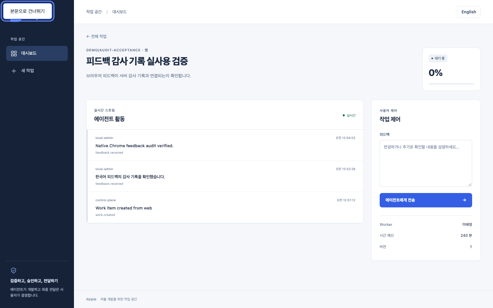
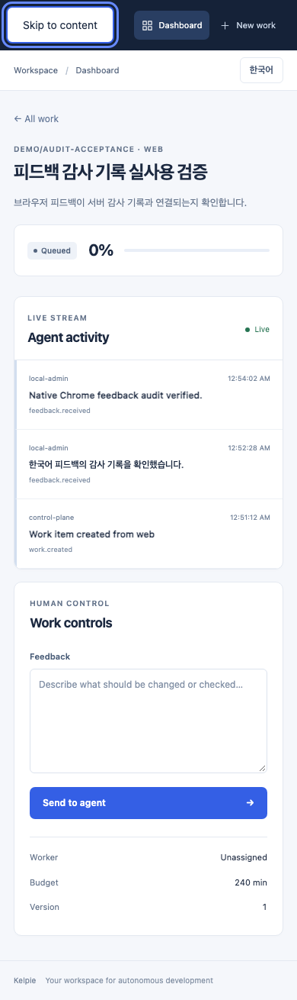

# 피드백 감사 기록

한국어 | [English](../en/feedback-audit.md)

## 범위와 보안 경계

IAM-001의 첫 감사 Batch입니다. 웹과 서명 검증·Principal 연결을 통과한 Slack 피드백이 성공하면 `feedback.created`를 `audit_records`에 추가합니다. 기존 피드백, 활동 이벤트, 상태 전환과 같은 DB 트랜잭션을 사용하며 감사 저장 실패 시 전체 변경을 Rollback합니다. 권한 거부·마감 상태·격리된 Worker에는 성공 기록을 남기지 않습니다.

- Actor Principal ID, Subject, Identity Provider, 조직·저장소, 실제 조직 Role·저장소 Grant·유효 Role·요구 Role을 당시 값으로 보존합니다. 개발 인증은 `identity_provider=development`, `actor_id=null`로 명시합니다.
- Request ID는 응답의 `X-Request-ID`와 같고 Correlation ID는 작업의 식별자입니다. 유효한 요청 UUID는 클라이언트가 지정할 수 있으므로 Request ID를 신원 증명이나 중복 방지 키로 사용하지 않습니다. 감사 행 ID는 DB에서 별도로 생성합니다.
- `source_ip`는 API의 ASGI Client IP이며 없거나 IP가 아니면 `null`입니다. 이 코드에서 `X-Forwarded-For`를 해석하지 않습니다. ASGI 서버의 신뢰 Proxy 설정에 따라 이미 변환된 주소일 수 있으므로, 운영자는 신뢰한 Proxy만 허용해야 합니다. Proxy Header를 끈 직접 실행은 연결 Peer를 기록하고, 중계 서버를 거치면 그 서버의 주소일 수 있습니다. Slack 주소는 사람의 단말 IP가 아닙니다.
- `transport`는 실제 Endpoint에서 정하며 요청의 `channel`을 신뢰하지 않습니다. 피드백 본문, Cookie, Bearer Token, 임의 Payload를 감사 행에 복사하지 않습니다. 기존 활동 로그의 본문 보존 정책은 바뀌지 않습니다. 생성 시각은 UTC입니다.
- 감사 행은 Live Resource에 대한 FK/Cascade가 없어 작업·피드백·멤버십 정리와 독립적으로 보존됩니다. 과거 활동 로그를 신뢰된 감사로 소급 변환하지 않습니다.

SQLite의 UPDATE/DELETE/REPLACE/UPSERT와 PostgreSQL의 UPDATE/DELETE/TRUNCATE/UPSERT를 DB Trigger로 차단합니다. 명시적 개발 Bootstrap에도 동일한 Guard가 설치됩니다. 이는 **일반 DML 경로의 추가 전용 보장**이며 DB 소유자·Superuser의 DDL, Trigger 비활성화, DB 파일 교체까지 막는 외부 WORM 또는 암호학적 증명이 아닙니다. 운영 DB 관리자를 신뢰 경계로 두고 Runtime DB 계정에 DDL·Trigger 관리 권한을 주지 않아야 합니다. 이 변경은 DB 계정을 자동 생성하거나 기존 권한을 바꾸지 않습니다.

근거: [SQLite Trigger](https://www.sqlite.org/lang_createtrigger.html), [REPLACE 충돌 처리](https://www.sqlite.org/lang_conflict.html), [PostgreSQL 17 Trigger](https://www.postgresql.org/docs/17/sql-createtrigger.html), [SQLAlchemy DDL Hook](https://docs.sqlalchemy.org/en/20/core/ddl.html).

## 조회 API

`GET /api/work-items/{id}/audit-log?after=0&limit=100`은 현재 조직 또는 해당 저장소의 Administrator만 사용할 수 있습니다. 다른 조직·없는 작업은 404, 권한 부족은 403입니다. `after >= 0`, `1 <= limit <= 1000`, 기본 100이며 마지막 행 ID를 다음 `after`로 전달합니다. 응답은 ID 오름차순 JSON 배열과 `Cache-Control: no-store`를 사용합니다. 쓰기·수정·삭제 HTTP Endpoint는 없습니다.

합성 응답의 주요 필드 예시(전체 계약은 `/openapi.json`):

```json
{
  "id": 1,
  "action": "feedback.created",
  "target_id": "1",
  "actor_subject": "demo-user",
  "identity_provider": "https://identity.example",
  "organization_role": "viewer",
  "repository_role": "approver",
  "effective_role": "approver",
  "required_role": "operator",
  "transport": "slack"
}
```

`target_id`는 피드백 행의 ID입니다. 신규 조회 API만 추가하며 기존 피드백 요청·응답과 활동 로그 형식은 유지합니다. 작업 삭제 후 감사 행은 남지만 작업별 HTTP 조회는 404이므로 보존 기록 조사는 별도 승인된 DB 접근으로 수행해야 합니다. 감사 UI와 보존/반출 도구는 이번 범위에 없습니다.

## Migration과 Rollback

1. 이 Batch는 `20260906_0006`을 도입했습니다. 현재 Rollout은 백업 후 `make migrate-api`와 Alembic `check`로 [후속 Console·승인 Migration](control-action-audit.md)까지 적용합니다. 새 환경변수나 의존성은 없습니다.
2. 빈 감사 테이블만 Online Downgrade할 수 있습니다. 검사 동안 PostgreSQL Table Lock 또는 SQLite Writer Lock을 잡습니다. 기록이 있으면 Downgrade를 거부하고 데이터와 Revision을 유지합니다. Offline Downgrade도 거부합니다.
3. 기록이 쌓인 뒤에는 데이터를 삭제하거나 Revision을 수동으로 낮추지 말고 현재 Schema와 Guard를 유지한 전진 수정으로 복구합니다. 이전 API는 최신 Schema를 Ready로 인정하지 않으므로 단순 Binary Rollback도 서비스 복구 수단이 아닙니다. 계획된 보존·보관·복구 절차를 먼저 마련해야 합니다.

## 검증 기록 · 2026-09-06

구현 `30f866d`, 브라우저 테스트 `5d4a444`, CI `3fb75b8` 기준입니다. 이후 문서·증거 추가는 동작을 바꾸지 않습니다.

- `make test`: API 261개, Runner 6개, Worker·Gateway Go 테스트, Web 40개와 TypeScript 통과. 기본 실행에서 생략한 PostgreSQL 17개는 전용 URL로 `test_worker_postgres.py test_audit_postgres.py`를 별도 실행해 모두 통과했습니다.
- `make lint`, 운영 Web Build, Chromium E2E 12개 통과. PostgreSQL 17 Upgrade/Check/Downgrade/Re-upgrade와 변경 차이 없음 확인. 기존 Python CI Job에 감사 테스트 8개를 추가했으며 로컬 PostgreSQL 감사 실행은 약 0.6초였습니다.
- 격리 SQLite API `:18520`와 운영 모드 Web `:13520`에서 Orca 한국어 화면으로 작업 생성·피드백 전송, 실제 Chrome 영어 화면에서 두 번째 피드백 전송·성공 안내·실시간 활동 표시를 직접 확인했습니다. 감사 행 2개, 서로 다른 Request ID, 본문 비복사, 조회 `no-store`를 확인했습니다. Orca Console 오류 없음, 조회·생성·피드백·SSE Network 2xx를 확인했습니다.
- 같은 실제 서비스의 KO/EN × 1440/390px 네 화면에서 입력 레이블, 가로 넘침 없음, 첫 키보드 대상인 Skip Link와 포커스, 화면 오류 없음을 검사하고 이미지를 직접 확인했습니다. UI 자체의 변경은 없으며 아래 이미지는 사용 증거입니다. 개발 인증의 로컬 검증이며 실제 OIDC Provider·Slack 서비스·VM 검증을 대신하지 않습니다.




[후속 Batch에서 Console 소유권과 승인 감사](control-action-audit.md)를 추가했습니다. 취소·전달·거부 시도 감사, 감사 보존·외부 보관 정책, OIDC Preview Grant, 실제 KVM·WireGuard·동시 VM 격리 등 남은 MVP 항목은 완료 처리하지 않습니다.
