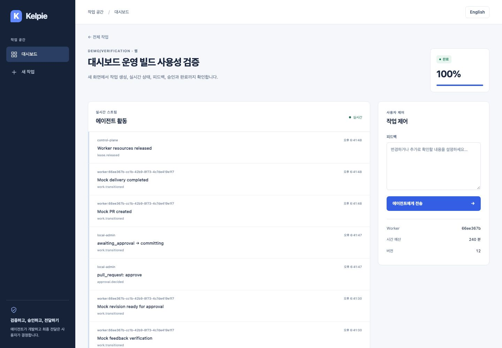
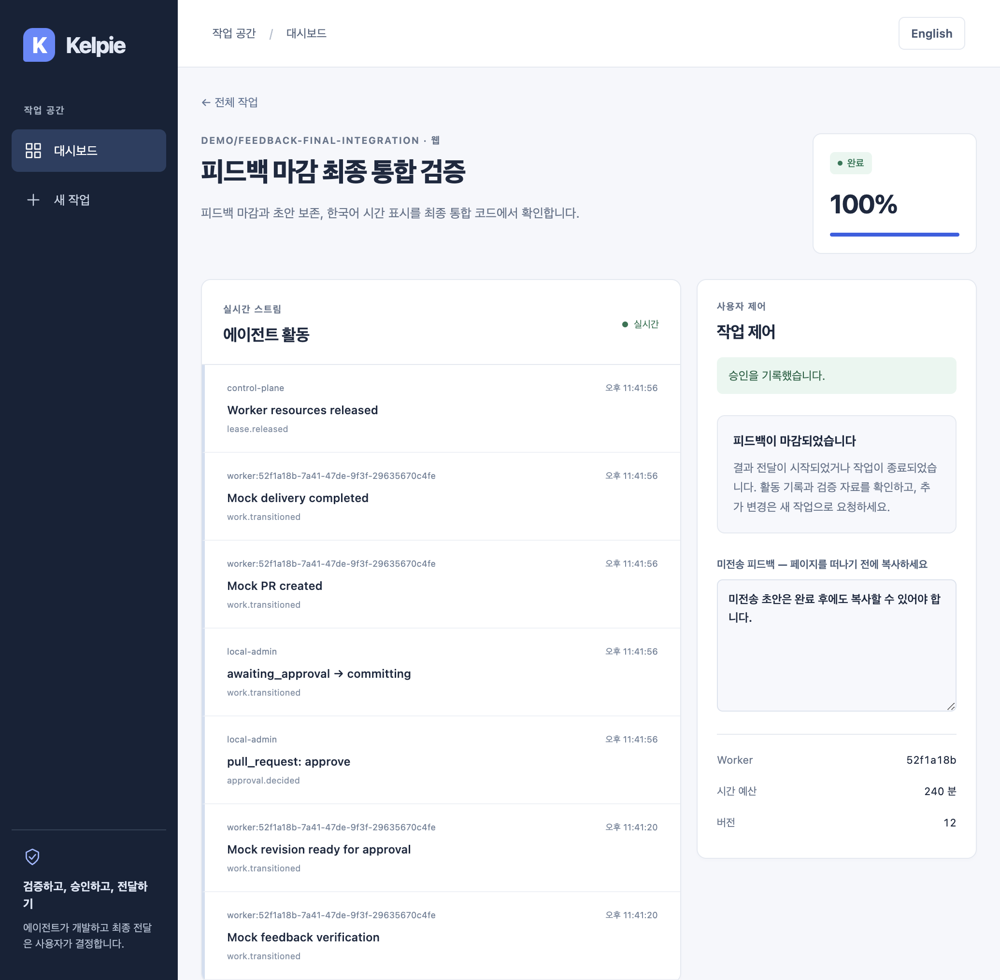

# 작업 상태별 피드백 — 2026-09-05

한국어 | [English](../en/feedback-lifecycle.md)

## 동작과 호환성

결과 전달이 시작된 `committing`, `pr_created`와 종료 상태인 `completed`, `failed`, `cancelled`는 더 이상 피드백을 받지 않습니다. 웹과 서명 검증을 거친 Slack 명령 모두 작업 잠금 안에서 동일하게 검사합니다. 기존 조직·저장소 권한 검사와 Worker 격리 검사는 유지합니다.

`queued`, `provisioning`, `analyzing`, `implementing`, `verifying`, `awaiting_feedback`, `awaiting_approval`, `awaiting_input`, `budget_exhausted`에서는 기존 접수 동작을 유지합니다. 세 가지 `awaiting_*` 상태만 `implementing`으로 복귀하며, 예산 소진 상태의 피드백이 예산이나 실행을 자동으로 재개하지는 않습니다.

다음 요청은 전달·종료 상태에서 이전의 `200` 대신 `409`를 반환합니다. 기존 클라이언트는 성공으로 표시하지 말고 작업 상태를 다시 조회해야 합니다. 거절 시 Feedback, 이벤트, 작업 버전·수정 시각은 변경되지 않습니다.

```http
POST /api/work-items/WORK_ID/feedback
Content-Type: application/json

{"message":"추가 변경 요청","channel":"web"}
```

```json
{"detail":"work no longer accepts feedback"}
```

Slack의 `/kelpie feedback WORK_ID 메시지`에도 같은 상태 제한을 적용합니다. 권한 거부·대상 숨김은 기존 `403`·`404`를 유지하며, Worker 격리의 `409` 안내도 유지합니다. 스키마·환경변수·DB 마이그레이션은 없습니다.

## 화면

마감 상태에서는 전송 버튼 대신 활동 기록·검증 자료 확인과 새 작업 요청을 안내합니다. 작성 도중 다른 창에서 승인하거나 작업이 종료되면 초안을 같은 페이지의 읽기 전용 입력에 보존합니다. 키보드로 선택·복사할 수 있고, 입력 중이던 포커스를 유지합니다. 초안은 서버나 브라우저 저장소에 저장하지 않으므로 새로고침·이동 전에 복사해야 합니다.

오래 열린 화면의 전송이 `409`로 거절되면 상태를 재조회하고 미전송 안내를 표시합니다. 새 초안을 입력하면 이전 전송 성공 안내를 지워 미전송 내용이 전송된 것으로 오해하지 않도록 합니다. 한국어·영어를 함께 갱신했습니다.

## 검증

- 수정 전 웹·Slack × 마감 상태 5종에서 회귀 테스트 10개 실패를 재현했습니다.
- `make test`: API 229개(실제 PostgreSQL 잠금 테스트 포함, Skip 없음), Runner 6개, Web 30개·타입 검사, Worker·Gateway Go 테스트 통과.
- `make lint`, `npm run build --prefix apps/web`: 통과.
- `npm run test:e2e --prefix apps/web`: 통합 코드에서 12개 통과, 최종 로컬 실행 약 1.1분. 새 API·DB·단일 슬롯 Mock Worker를 매번 사용합니다.
- 실제 API·Worker가 승인·완료된 뒤, SSE가 끊긴 브라우저의 늦은 피드백이 409로 거절되는 것과 초안 선택·복사를 검증합니다. 실시간 종료 시 포커스·초안 유지와 이전 성공 안내 제거도 검증합니다.
- 마감 5종 × 한국어·영어, 390px 가로 넘침, 검증 자료 링크는 명시적인 화면 응답 Fixture로 추가 확인합니다. 이것을 실제 실패·취소 실행 검증으로 간주하지 않습니다.
- 별도 로컬 SQLite API + scoped 인증 Mock Worker 2개 + 운영 Web 빌드에서 Orca 브라우저로 작업 생성·정상 피드백·재검증·새 초안 입력을 수행했습니다. Chrome Computer-use로 같은 작업을 영어 화면에서 승인하고, 한국어 화면의 SSE 마감·초안 보존·전송 버튼 제거를 직접 확인했습니다.
- 최종 실제 작업은 `completed`, 버전 12, 정상 피드백 이벤트 1개입니다. 늦은 전송 409 후 작업·이벤트가 그대로이고 두 Worker의 자원이 모두 복구된 것을 확인했습니다. 정상 브라우저 콘솔 오류와 390px·영어 별도 Chromium 렌더링의 요청·페이지 오류는 없었습니다.
- 실제 사용에서 발견한 이전 성공 안내 잔류를 수정하고, 운영 빌드를 재생성하여 같은 교차 브라우저 여정을 다시 확인했습니다.
- 최초 PR CI는 성공했지만 로그 검토에서 한국어 시간의 Hydration 오류 5건을 발견해 머지를 중단했습니다. 별도 [시간 표시 수정과 전역 브라우저 오류 검사](time-hydration.md)를 먼저 머지하고 통합했습니다. 처리되지 않은 페이지 오류가 있으면 모든 E2E가 실패하도록 검사합니다.
- 통합 커밋 `69958be`에서 전체 검증 후 운영 빌드와 격리된 실행 환경을 다시 만들었습니다. Orca에서 생성·피드백·재검증·새 초안·승인·완료를 확인하고, 실제 Chrome의 영어 완료 화면도 확인했습니다. 최종 이미지와 상태·이벤트·자원 검증은 이 통합 실행 결과이며, 한국어 시간은 브라우저의 지역화 결과와 일치합니다.

변경 전후는 서로 다른 합성 테스트 작업입니다. 변경 전 자료는 기존 대시보드 검증의 완료 화면을 재사용합니다. 변경 후 초안 화면은 Orca에서 직접 캡처했고, 영어·390px 화면은 동일한 운영 Web 빌드를 별도 Chromium으로 렌더링했습니다.





[영어 화면](../assets/feedback-lifecycle/completed-en.jpg) · [390px 화면](../assets/feedback-lifecycle/mobile-ko.jpg)

## 범위와 후속 작업

새 의존성이나 인증·승인 정책 변경은 없습니다. 롤백은 관련 기능 커밋을 되돌리면 되지만, 종료 작업에 대한 무효 피드백 접수가 다시 허용됩니다. 실제 GitHub 전달·IdP·VM·WireGuard·noVNC는 이 Mock 검증의 범위가 아닙니다.

실패·취소 상태의 잘못된 100% 진행률 표시는 [독립된 후속 UI 변경](terminal-progress.md)에서 수정했습니다. 문서의 나머지 MVP 항목(불변 감사 기록, Preview 권한, Secret 검사, 운영 준비·실제 VM 검증)은 계속 진행해야 하며, 이번 변경만으로 MVP 완료를 선언하지 않습니다.
