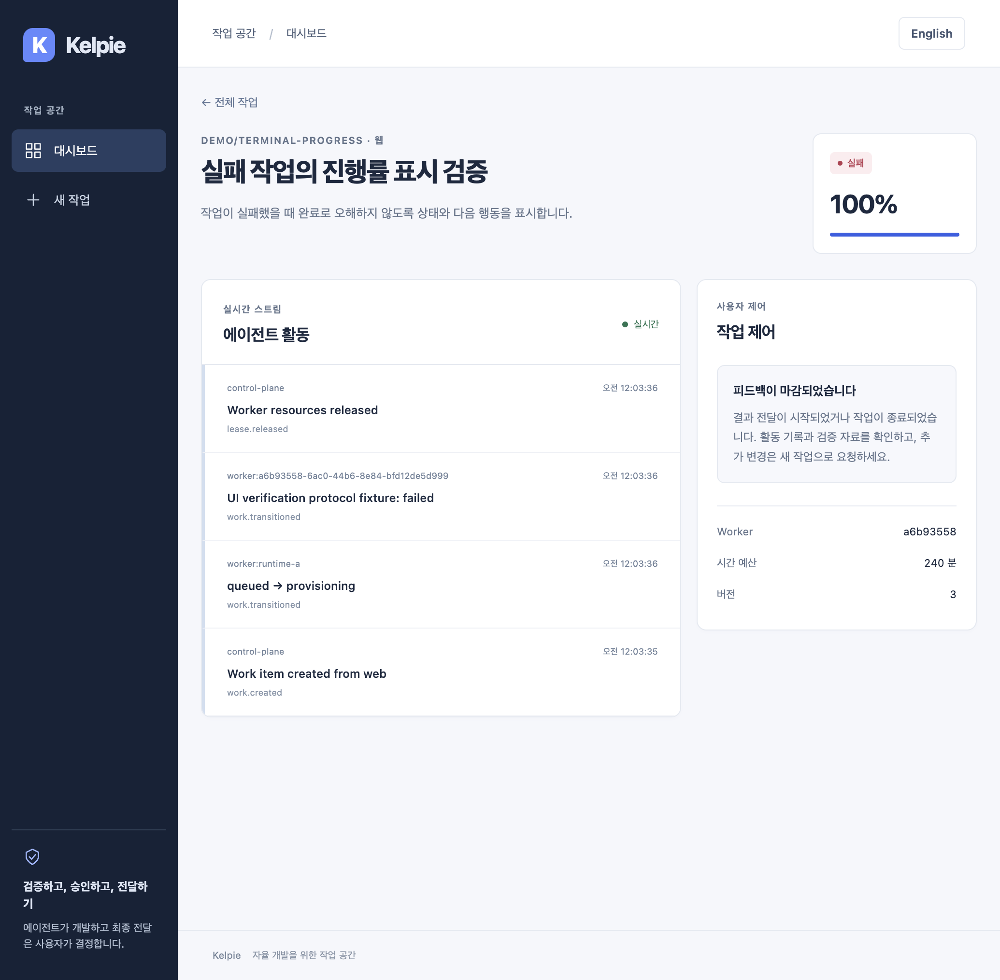
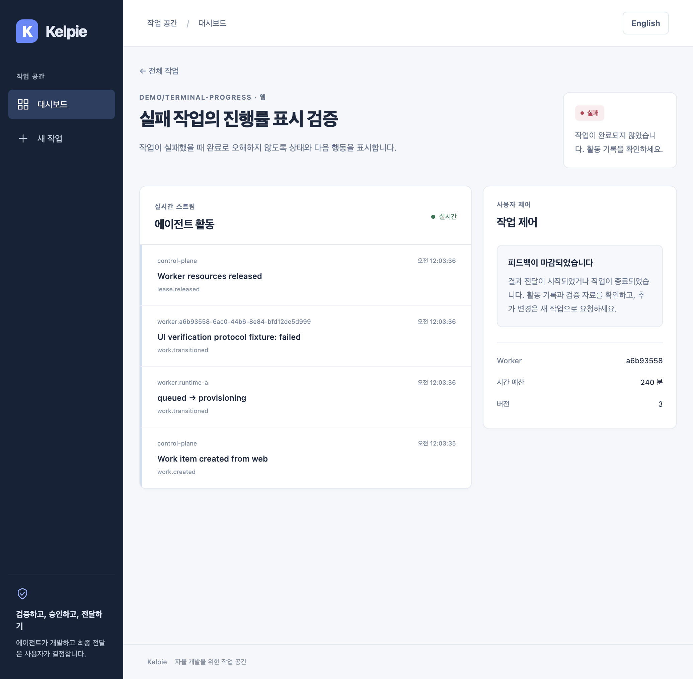

# 종료된 작업의 진행률 — 2026-09-06

한국어 | [English](../en/terminal-progress.md)

## 변경

`failed`, `cancelled` 작업에 표시되던 100%와 가득 찬 진행 막대를 제거했습니다. 상태 배지를 유지하고 작업이 완료되지 않았다는 안내와 활동 기록 확인을 제공합니다. 좁은 화면에서는 안내를 상태 아래에 일관되게 배치합니다. 한국어·영어를 동기화했습니다.

정상 완료의 100%, 나머지 상태의 기존 단계별 수치, 피드백 마감·초안 보존은 유지합니다. 표시용 `statusProgress`만 `number | null`로 바뀌며 모든 사용처를 갱신했습니다. API 상태 계약·DB·승인·인증·환경변수·의존성은 변경하지 않습니다.

## 검증

- 수정 전 실패·취소 숫자 회귀 2개와 한국어·영어 화면 회귀 4개가 실패했습니다. 실사용에서 발견한 좁은 화면 배치도 E2E 실패를 재현한 후 수정했습니다.
- `make test-web`: 40개 및 타입 검사 통과. `make lint`, `npm run build --prefix apps/web`: 통과.
- `npm run test:e2e --prefix apps/web`: 12개 통과, 최종 로컬 실행 약 1분. 실제 API·단일 슬롯 Mock Worker의 생성·피드백·승인·완료 흐름과 기존 오류·권한·SSE·시간 회귀를 유지합니다. 종료 상태별 화면은 명시적인 응답 Fixture로 검사합니다.
- 별도 SQLite API와 운영 Web 빌드(`13520`/`18520`)를 실행했습니다. Orca에서 작업 생성 후 테스트 Worker 프로토콜로 실패·취소를 전환했습니다. 실패 화면은 변경 전후 재진입으로 비교했고, 취소 작업은 SSE 갱신에서 0%가 종료 안내로 바뀌고 막대가 없어지는 것을 확인했습니다.
- Chrome Computer-use로 영어 실패 화면에 직접 진입해 안내·마감 상태를 확인했습니다. 개인 탭이 있는 네이티브 화면 원본은 게시하지 않습니다.
- 모바일 보정 후 `342e923` 운영 빌드에서 Orca 화면을 다시 캡처하고, 독립 Chromium으로 한국어·영어 × 1440px·390px × 실패·취소·완료의 12개 조합을 재검증했습니다. 종료 안내, 완료 100%, 좁은 화면의 세로 배치, 가로 넘침 없음, 키보드 첫 포커스와 표시를 확인했습니다. 정상 페이지·요청 오류와 Orca 콘솔 오류는 없었습니다.
- 최초 완료 막대 E2E에서 렌더링 전 폭 0을 기대값으로 읽는 측정 문제가 있었습니다. 표시된 두 요소의 폭이 일치하는지 재시도하여 검증하도록 고쳤으며 타임아웃·검사 수준은 낮추지 않았습니다.

Web 전용 변경이므로 로컬 `make test-api`, `make test-runner`, `make test-worker`, `make test-gateway`, `make test`는 이 작업에서 별도 실행하지 않았습니다. PR CI는 기존 전체 컴포넌트 검사와 PostgreSQL 검증을 유지합니다. 실제 VM 실패·취소·GitHub 전달·IdP·WireGuard·noVNC는 테스트 프로토콜과 Mock 여정으로 증명하지 않습니다.

## 화면

변경 전후 한국어 화면은 동일한 합성 실패 작업을 Orca에서 직접 캡처했습니다. 영어·390px는 최종 운영 빌드의 독립 Chromium 화면이며 본문 건너뛰기 키보드 포커스도 보여줍니다.

[영어 화면](../assets/terminal-progress/after-en.jpg) · [390px 취소 화면](../assets/terminal-progress/mobile-ko.jpg)

## 영향과 후속 작업

롤백은 기능 커밋을 되돌리면 되지만 실패·취소의 오해를 부르는 100% 표시가 다시 나타납니다. 데이터 마이그레이션은 없습니다. 불변 승인 감사, Preview 권한, Secret 비노출, 운영 준비·보존 정책, 실제 KVM 격리는 계속 필요한 MVP 항목입니다.
