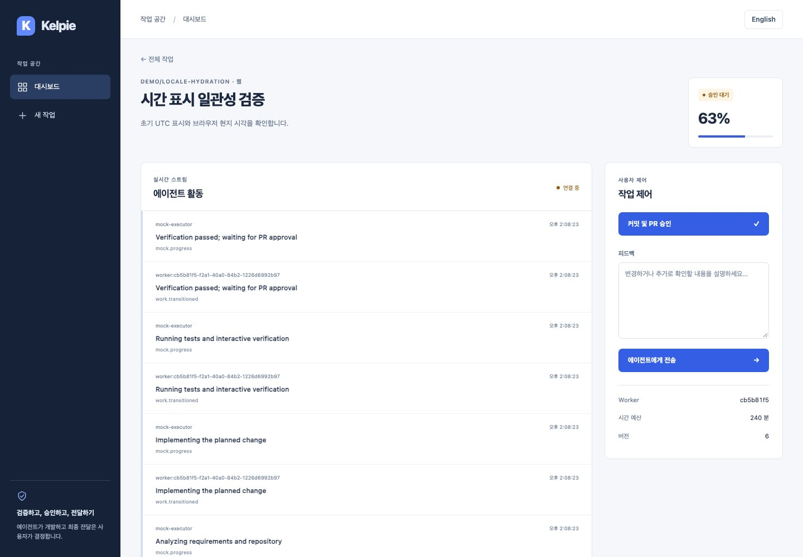

# 시간 표시 Hydration 검증 — 2026-09-05

한국어 | [English](../en/time-hydration.md)

## 원인과 수정

피드백 PR의 첫 [CI 실행](https://github.com/haesookimDev/dev-agent/actions/runs/33970545553)은 통과했지만, 로그에 한국어 시간의 서버 `PM 2:03:03` / 브라우저 `오후 2:03:03` 불일치가 5회 기록됐습니다. 머지를 보류하고 시간 표시 수정을 독립된 변경으로 분리했습니다.

서버와 브라우저의 시간대를 모두 UTC로 맞추더라도 두 런타임의 언어 데이터가 같은 문자열을 보장하지는 않습니다. 이제 서버와 최초 Hydration은 언어 데이터에 의존하지 않는 `HH:mm:ss UTC` 또는 `YYYY-MM-DD HH:mm UTC`를 사용합니다. 브라우저가 준비된 뒤에만 한국어·영어와 브라우저 현지 시간대로 변환합니다. 원본 `dateTime`과 UTC `title`은 유지합니다. Hydration 경고를 숨기지 않습니다.

## 검증

- `make test-web`: 15개와 타입 검사 통과. 서버 Locale 형식을 바꾼 회귀 테스트 3개는 수정 전 실패하고 수정 후 통과합니다.
- `make lint`, `npm run build --prefix apps/web`: 통과.
- `npm run test:e2e --prefix apps/web`: 한국어·영어의 브라우저 Locale 형식을 의도적으로 서버와 다르게 만들고 Honolulu 시간대에서 목록 날짜·이벤트 시각·Hydration 오류 없음을 확인합니다. 기존 실제 API·Mock Worker 여정도 유지합니다.
- 공통 E2E Fixture가 모든 테스트의 처리되지 않은 `pageerror`를 검사합니다. 임시 테스트에서 실제 오류를 발생시켜 Fixture 자체가 실패하는 것을 확인한 뒤 임시 코드를 제거했습니다. 의도적인 네트워크 실패 검증은 그대로 통과합니다.
- 별도 SQLite API + scoped 인증 Mock Worker + 운영 Web 빌드에서 같은 작업의 Hydration 전 화면을 변경 전후 캡처했습니다. 번들 요청만 차단하고 스트리밍 HTML의 표시 스크립트는 실행하여 초기 렌더링을 관찰했습니다. 이 캡처의 번들 통신 실패는 의도적인 실험 조건입니다.
- 정상 Orca 한국어 화면에서 `14:08:23 UTC`가 서울 현지 시각 `오후 11:08:23`으로 표시되는 것과 콘솔 오류 없음을 확인했습니다. Chrome Computer-use에서는 영어 `11:08:23 PM`을 육안 확인하고 작업을 승인하여 완료·자원 해제까지 확인했습니다.
- 별도 Chromium의 영어 1440px·한국어 390px에서 각각 이벤트 시각 15개를 브라우저의 현지 시각과 비교했습니다. 요청·페이지 오류와 가로 넘침은 없었습니다.

API·Runner·Worker·Gateway의 코드는 바꾸지 않아 이 단위에서 해당 로컬 테스트를 다시 실행하지 않았습니다. 일반 GitHub CI는 전체 컴포넌트 검사를 유지합니다. 실행기는 Mock이며 실제 VM·SCM 전달 검증을 대체하지 않습니다.

## 변경 전후

아래 두 화면은 같은 작업의 **브라우저 현지화 전** 상태입니다. 평상시 현지화가 끝난 디자인과 시간 표기는 유지됩니다. 초기 단계에 UTC 문자열이 잠깐 보일 수 있습니다.

[현지화 후 한국어 390px 화면](../assets/time-hydration/hydrated-ko.jpg)

새 의존성·설정·API 계약·DB 마이그레이션은 없습니다. UTC 표기는 언어 중립적인 표준 약어이며 두 언어에 동일하게 적용합니다. 롤백하면 런타임 Locale 차이로 인한 화면 재구성 오류가 다시 발생할 수 있습니다.
