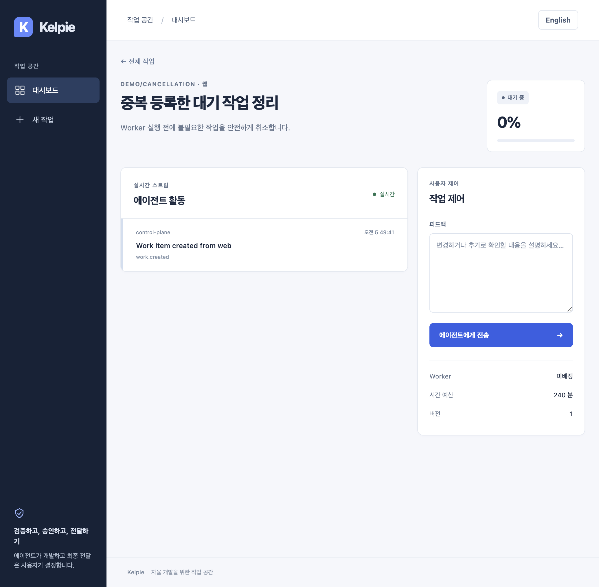
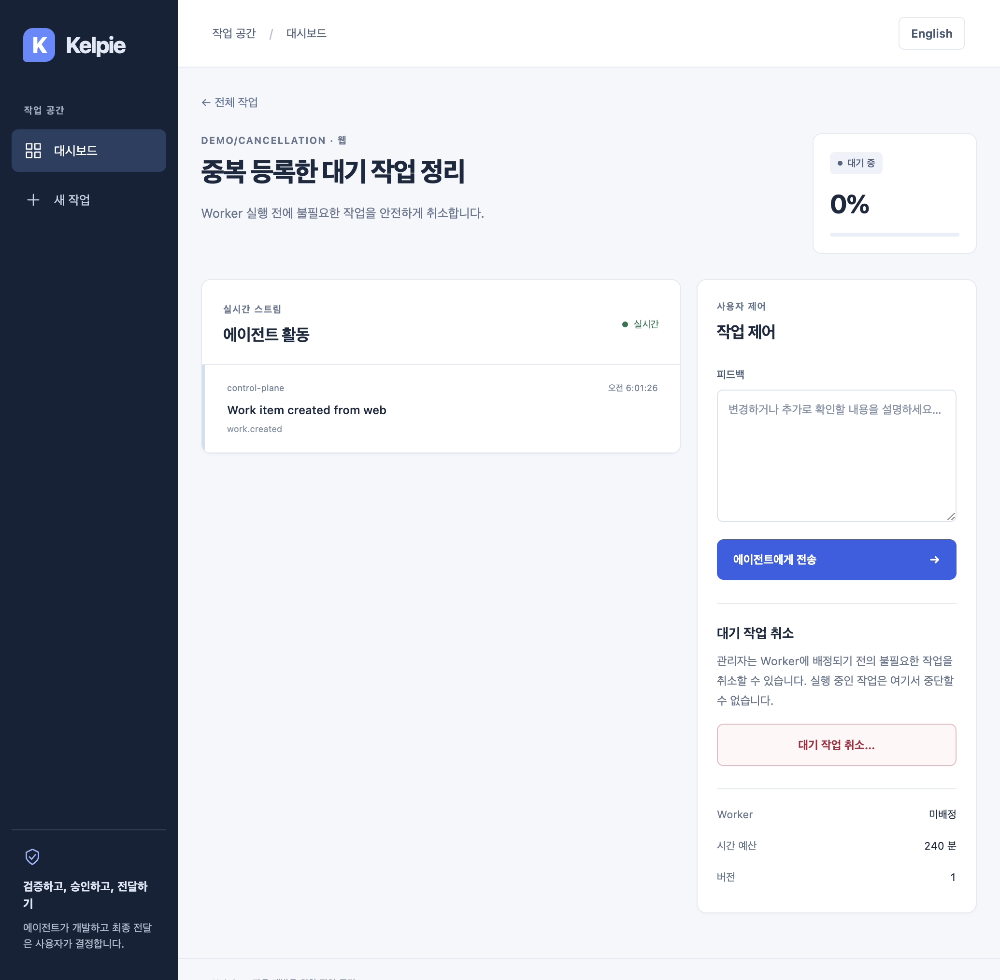

# 미배정 대기 작업 취소

한국어 | [English](../en/work-cancellation.md)

## 범위와 사용법

관리자는 불필요하거나 중복 등록한 작업을 Worker 실행 전에 취소할 수 있습니다. 작업 상세의 **대기 작업 취소…**를 누르고, 작업명과 영향을 확인한 뒤 **작업 취소 확정**을 선택합니다. 기본 포커스는 **돌아가기**에 있으며 제출 전 Esc로 닫아도 작업은 바뀌지 않습니다.

- 서버가 허용하는 대상은 `queued`, `assigned_worker_id=null`, Resource Lease 기록 없음의 세 조건을 모두 만족하는 작업입니다. 만료·해제된 임대 기록도 실행 이력으로 보고 거절합니다.
- 취소하면 `cancelled`로 전환하고 버전을 1 증가시킵니다. 이후 Claim 대상에서 제외되며, 작업·이벤트·감사 기록을 삭제하지 않습니다. 되돌리기나 자동 재등록은 제공하지 않습니다.
- 실행 중·승인 대기·전달 중·실패·완료된 작업은 이 기능으로 취소하지 않습니다. VM 종료, 네트워크 차단, 임대 강제 해제, Worker 격리, Slack 취소도 이 경로의 동작이 아닙니다.
- UI의 표시 조건은 대기 상태와 미배정 여부입니다. 권한과 임대 이력은 서버에서 다시 검증합니다. 버튼이 보이는 것만으로 관리자 권한이 부여되지 않습니다.
- 처리 중에는 중복 제출을 막습니다. 취소 요청은 브라우저에서 10초, 실패 후 상태 재조회는 5초로 제한됩니다. 통신 실패는 서버에서 미처리됐다는 뜻이 아닙니다. 최신 상태를 확인하고, 취소됐다면 다시 제출하지 마세요.
- 성공하면 상태와 피드백 제어가 즉시 갱신되고 상태 영역으로 포커스가 이동합니다. 미전송 피드백은 페이지를 떠나기 전 복사할 수 있도록 읽기 전용으로 남습니다. 초안은 서버에 저장되지 않습니다.

## API와 권한

```http
POST /api/work-items/00000000-0000-4000-8000-000000000042/cancel
Content-Type: application/json

{"expected_version": 1}
```

인증된 Web Session과 같은 Origin 요청을 사용합니다. 조직 기본 역할 또는 해당 저장소 Grant를 포함한 유효 역할이 `administrator`여야 합니다. 다른 조직에는 관리자 역할도 적용되지 않습니다. 실제 세션 값은 예시에 포함하지 않습니다.

성공 응답은 기존 `WorkItemView` 전체이며, 핵심 필드는 다음과 같습니다.

```json
{"id":"00000000-0000-4000-8000-000000000042","status":"cancelled","version":2,"assigned_worker_id":null}
```

| 응답 | 의미 |
| --- | --- |
| 200 | 취소·상태 이벤트·감사 기록이 같은 Transaction으로 Commit됨 |
| 401 / 403 | 인증 실패, 관리자 역할 부족, Membership 회수 또는 Origin 거부 |
| 404 | 작업이 없거나 다른 조직·등록되지 않은 저장소의 작업 |
| 409 | 버전 충돌, 이미 취소됨, 실행 상태·배정·임대 이력으로 취소 불가 |
| 422 | 양의 정수 `expected_version` 누락·형식 오류; 문자열·Boolean 강제 변환 없음 |

반복 요청은 성공으로 재처리하지 않고 409를 반환합니다. 조회 응답의 최신 버전을 사용하되 사용자 확인 이후 상태가 바뀌면 새로 확인해야 합니다. 기존 응답 구조·상태 값·Worker 계약·환경변수는 바꾸지 않았고 DB Migration은 없습니다. API를 먼저 배포한 뒤 Web을 배포하세요.

## 감사와 경쟁 조건

성공 시 기존 추가 전용 `audit_records`에 `work.cancelled`를 남깁니다. Actor ID·Subject·Identity Provider·조직/저장소/유효/필수 Role·Request ID·Correlation ID·ASGI Peer IP·작업/저장소/조직을 기록합니다. 사용자 지정 Forwarded Header는 Source IP로 신뢰하지 않습니다. `details`는 `scope=unassigned_queue`, 변경 전후 상태와 버전만 포함합니다. 자유 입력 사유·토큰·원문 요청을 복사하지 않습니다.

기존 관리자 전용 `GET /api/work-items/{id}/audit-log`에서 조회하며 `Cache-Control: no-store`를 유지합니다. 감사 Insert가 실패하면 취소·버전·수정 시각·상태 이벤트도 Rollback됩니다. 거절된 요청에는 성공 감사가 생기지 않습니다. [기존 감사 저장소 보호](feedback-audit.md)를 그대로 사용합니다.

운영 경쟁 보장은 PostgreSQL의 Work Item 행 잠금을 사용합니다. Claim과 같은 행을 잠그되 Worker 잠금을 역순으로 추가하지 않습니다. Claim이 먼저 Commit되면 취소는 최신 배정 상태를 읽고 거절됩니다. 취소 중 잠긴 작업은 Claim의 `SKIP LOCKED`로 건너뛰고 다른 작업을 처리할 수 있습니다. 취소 Transaction이 Rollback되면 다음 Claim이 원래 작업을 가져올 수 있습니다. SQLite 단독 실행을 PostgreSQL 동시성 검증으로 대신하지 않습니다.

## 검증 기록 — 2026-09-06

구현 커밋은 API `0f2fd57`, PostgreSQL 경쟁 테스트 `d0bb7fa`, CI `6eb0aae`, Web `2e38022`, 포커스 회귀 수정 `1b7bd5e`입니다. 다음 문서·이미지 변경은 동작을 바꾸지 않으며 최종 PR Head의 재확인 결과는 PR에 기록합니다.

- `KELPIE_TEST_POSTGRES_URL=<전용 테스트 DB> make test`: API 405개(신규 취소 34개·실제 PostgreSQL 경쟁 4개 포함), Runner 6개, Web 52개·타입 검사, Worker·Gateway 통과. 테스트 DB URL에는 실제 운영 자격증명을 넣지 않습니다.
- `make lint`, `npm run build --prefix apps/web`: 통과.
- `npm run test:e2e --prefix apps/web`: 실제 API·마이그레이션된 임시 SQLite·단일 슬롯 Mock Worker·Chromium에서 18개 통과, 로컬 약 1분 30초. 신규 취소 여정 6개는 한·영, 좁은 화면, Esc/포커스, 중복 제출, 403 표시, 실제 409, 성공 응답 유실 후 재조회, SSE 변경 중 확인 창을 검증합니다. 403의 Web 표시는 명시적 응답 Fixture이며 실제 OIDC 권한 거부는 API 테스트로 검증합니다.
- 전체 E2E가 닫힌 취소 창의 불필요한 오류 렌더링을 재현했습니다. 열린 확인 상태에서만 오류를 렌더링하도록 수정하고 기존 테스트를 변경하지 않은 채 전체 재통과했습니다.
- 실제 운영 빌드에서 취소 후 포커스가 `BODY`로 빠지는 문제를 재현했습니다. 지연된 `close` 이벤트와 React 상태 갱신 순서에 의존하지 않고 창을 닫은 직후 유지되는 상태 영역에 포커스를 옮깁니다. 이벤트 이전 포커스를 관찰하는 회귀 검증은 수정 전 `false`로 실패했고 수정 후 한·영 모두 통과했습니다. Web 52개·타입 검사·Lint·전체 E2E 18개도 다시 통과했습니다.
- 별도 실제 API `127.0.0.1:18440`·운영 Web `127.0.0.1:13440`를 실행했습니다. 직접 Orca 브라우저로 작업 등록, 취소 확인, Esc 복귀, 키보드 확정, 상태·감사 1건·버전 `1→2`·미배정 유지·피드백 종료를 확인했습니다. 한국어 데스크톱과 390px 영어 화면의 긴 작업명·가로 넘침·기본 포커스를 확인했습니다. 모바일은 데스크톱 Chromium의 기기 에뮬레이션이며 실제 iPhone 검증이 아닙니다.
- Computer Use로 Orca 데스크톱의 실제 대시보드를 육안 확인했습니다. 네이티브 포커스가 없는 환경이므로 OS 키보드/마우스 입력은 검증하지 않았습니다. 이 PR은 네이티브 입력·Console·VM 코드를 변경하지 않습니다.
- 최종 한국어 취소 요청은 HTTP 200이며 화면의 숨은 오류 요소는 0개입니다. 한국어·영어 검증 탭의 콘솔 메시지는 없었습니다. 실제 기본 취소 버튼의 글자·배경 색 대비는 약 6.55:1입니다.
- 직접 구동은 격리된 개발 인증이며 Worker/SCM/외부 알림을 실행하지 않았습니다. 테스트와 실제 사용 증거를 기업 IdP·운영 배포·실제 KVM 취소 증거로 해석하지 마세요.

필수 `Python` CI는 PostgreSQL 경쟁 4개를 별도 단계로 실행합니다. 로컬 해당 단계는 약 1.2초이며 기존 필수 검사 이름·8분 제한·읽기 전용 Token·전체 테스트는 유지합니다.

## 화면

테스트 데이터만 담은 변경 전후 화면입니다. 전후 작업 ID·시각은 다르며 생성된 스크린샷을 편집하지 않았습니다.





[한국어 확인 창](../assets/work-cancellation/confirm-ko.png) · [390px 영어 확인 창](../assets/work-cancellation/confirm-mobile-en.png)

[취소 후 상태 포커스와 초안 보존](../assets/work-cancellation/cancelled-ko.png)

## 남은 범위와 롤백

이 Batch는 IAM/OPS 전체 완료가 아닙니다. 실행 중 관리자 취소는 실제 VM 종료·정리 확인과 정확히 한 번의 자원 반환을 구현·검증한 뒤 추가해야 합니다. 전체 전달 감사, 보존 Janitor, Backup/Restore, OIDC Preview 직접 검증과 실제 KVM/네트워크/두 작업 격리도 남아 있습니다.

기능 롤백은 Web과 API 코드를 이전 버전으로 되돌립니다. 이미 취소된 작업과 추가 전용 감사 기록은 보존하며 수동 SQL로 되살리거나 감사를 삭제하지 않습니다. 이전 버전도 기존 `cancelled` 상태를 이해합니다. 실행이 다시 필요하면 권한 있는 사용자가 새 작업을 등록합니다.
